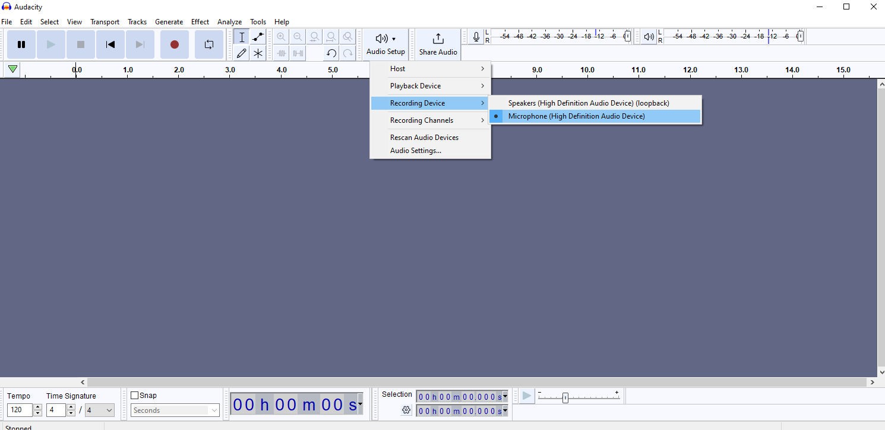
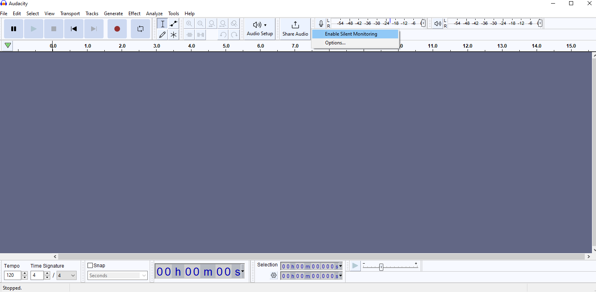
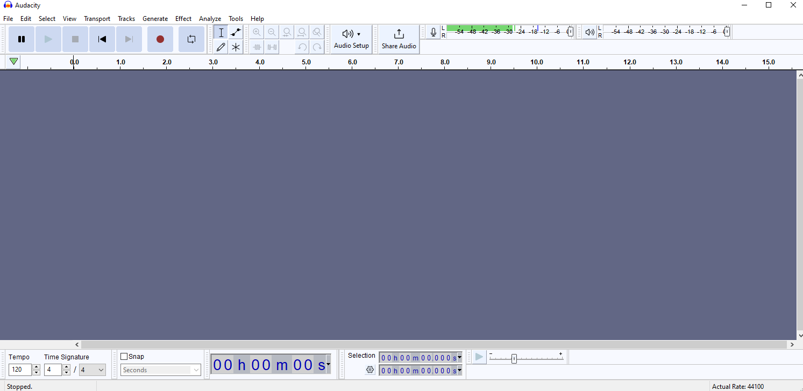
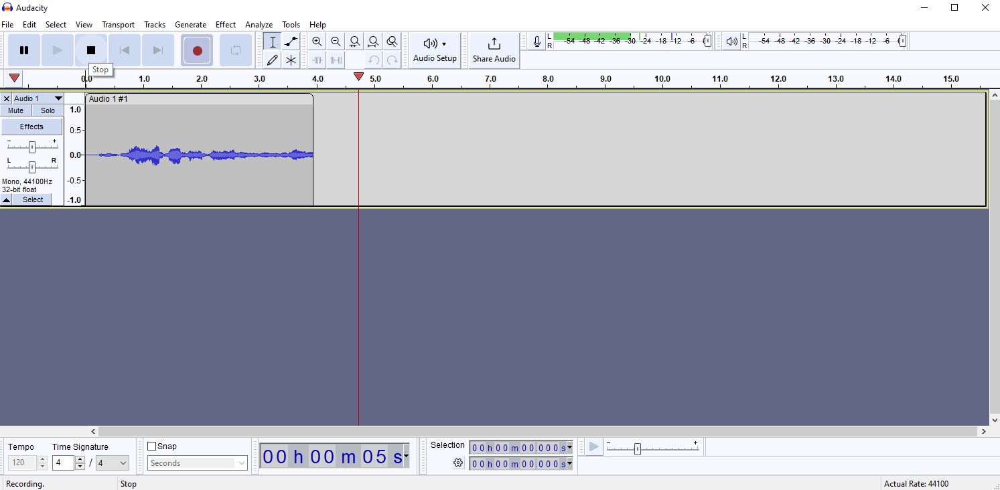

# :book: Activar el Micrófono y Grabar la Voz.

Audacity puede grabar distintos tipos de micrófonos y otros dispositivos de audio.

1. Conecta tu micrófono.
2. Configura el micrófono en Audacity.
   1. Abre Audacity.
   2. Haz clic en el botón de "Audio Setup".
   3. Seleciona Recording Device.
   4. Elige el dispositivo de micrófono.

      ||
      |:--:|
      | |
      |Fig. 1 Recording Device|

3. Haz una prueba.
   1. Haz clic en el botón de "Record meter".
   2. Selecciona "Start Monitoring" o "Enable Silent Monitoring".

      ||
      |:--:|
      | |
      |Fig. 2 Record Meter|

   3. Observa el desplazamiento de la barra del "Record Meter" cuando emites sonidos.

      ||
      |:--:|
      | |
      |Fig. 3 Record Meter Level|

   4. Nuevamente haz clic en el botón de "Record meter" y selecciona "Stop Monitoring" o "Disable Silent Monitoring".

4. Graba tu voz.
   1. Presiona el botón de grabación.
   2. Habla o emite sonidos por unos cuantos segundos.
   3. Oprime el botón para detener la grabación.
   4. Reproduce lo grabado.

      ||
      |:--:|
      | |
      |Fig. 4 Recording Example|

# :books: Referencias
- [Audacity Tutorial - Your First Recording](https://manual.audacityteam.org/man/tutorial_your_first_recording.html)