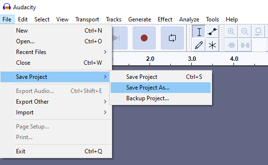
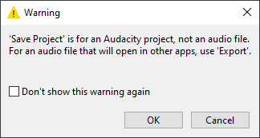
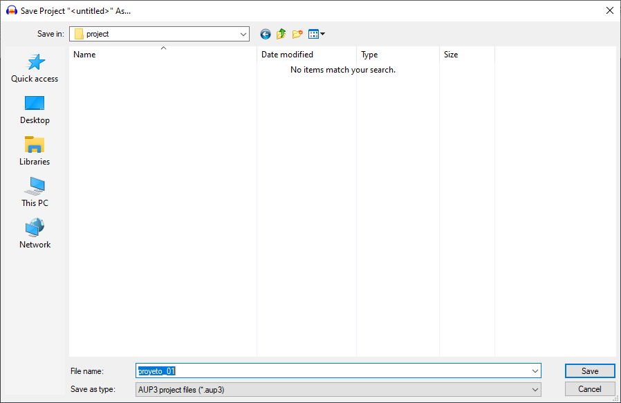
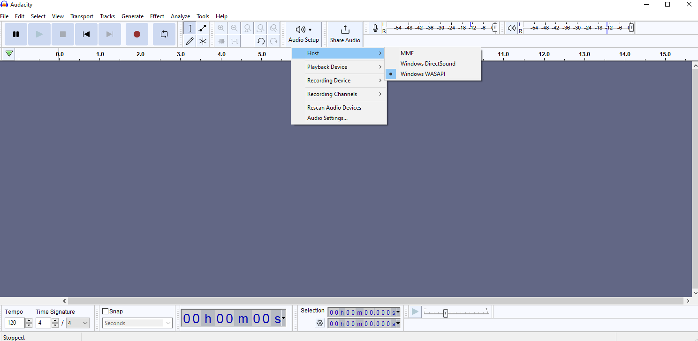
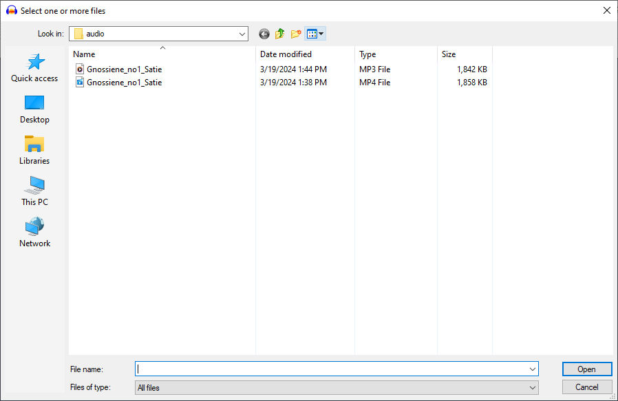
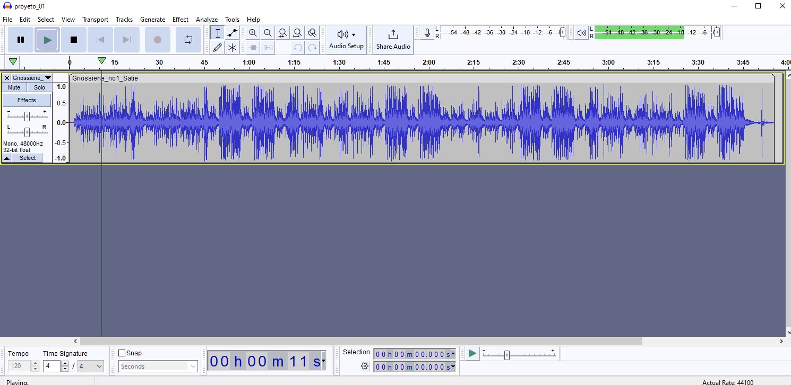

# :book: 4. Grabar desde el Escritorio

1. Abra la applicación de **Audacity**.

2. Cree un nuevo proyecto. 
    - Abra el menú **File** > **Save Project As...**

      ||
      |:--:|
      | |
      |Fig. 1 Save Project As...|

    - Presione el botón de **OK** cuando la ventana de advertencia emergente aparezca.

      ||
      |:--:|
      | |
      |Fig. 2 OK|

    - Elija el directorio de trabajo destino y dé nombre a su projecto. Después presione el botón "**Save**".

      ||
      |:--:|
      | |
      |Fig. 3 Save|

3. Seleccione el dispositivo fuente. 

    - Utilice el botón de "**Audio Setup**" de la barra de herramientas. 
    - Después "**Host**".
    - Finalmente la opción de "**Windows WASAPI**".

      ||
      |:--:|
      | |
      |Fig. 4 Audio Setup|

4. Abra el archivo de audio. Abra el menú **File** > **Open** y después seleccione el archivo de audio.

      ||
      |:--:|
      | |
      |Fig. 5 Audio File|

5. Comience a reproducir con el botón de reproducción :arrow_forward: "**Play**".

      ||
      |:--:|
      | |
      |Fig. 6 Play|

# :books: ReferenciaS

- [Audacity :registered: Tutorials for Audacity](https://manual.audacityteam.org/man/tutorials_for_audacity.html)