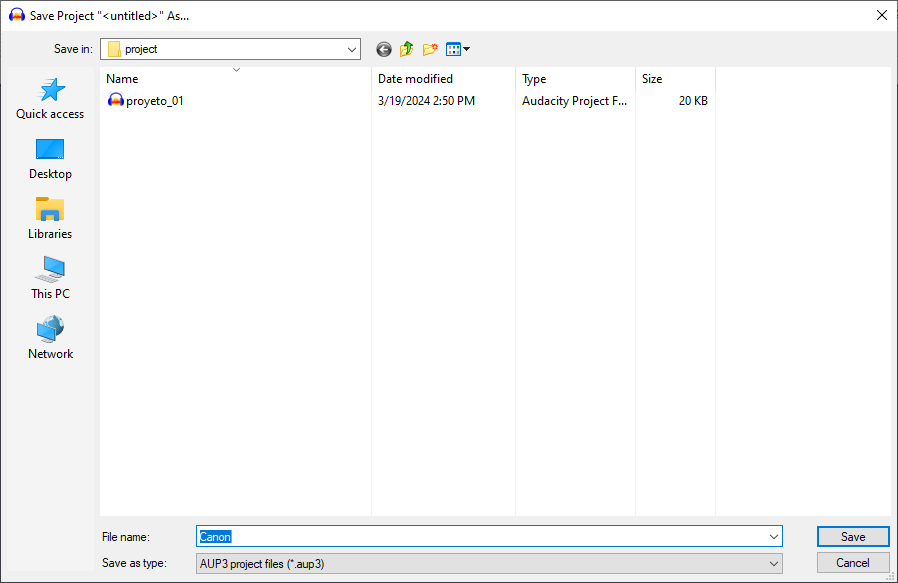
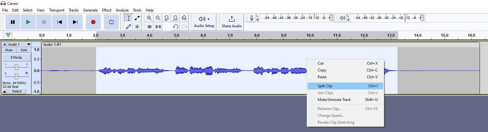
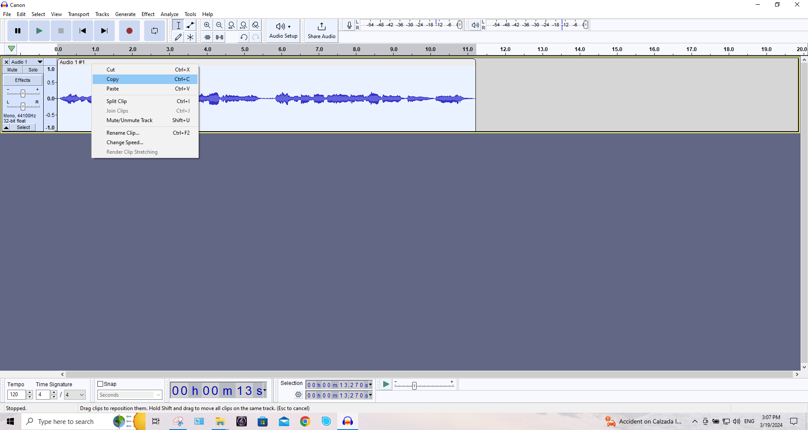
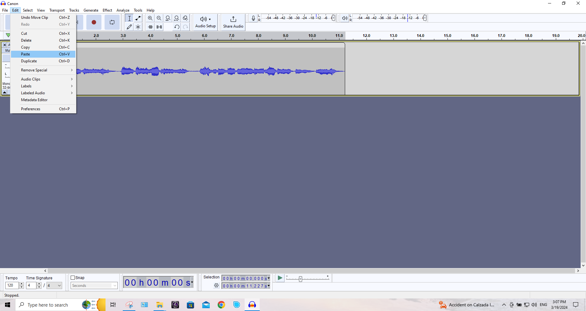
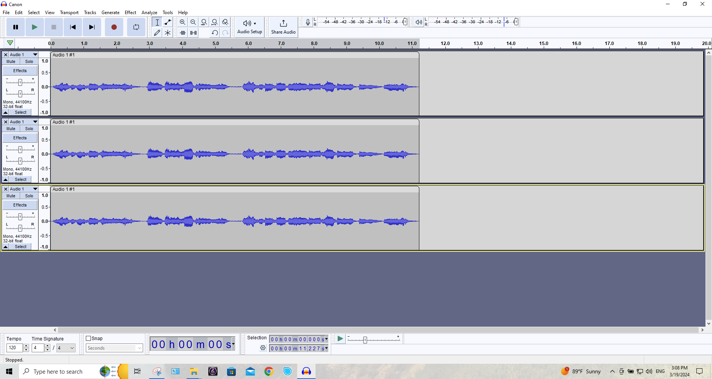
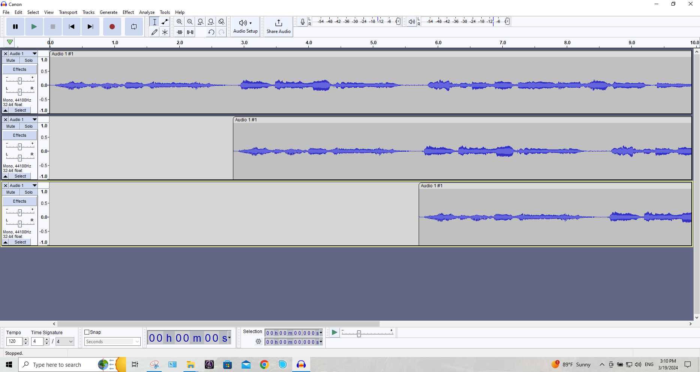
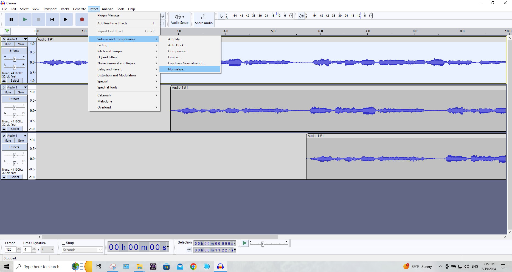
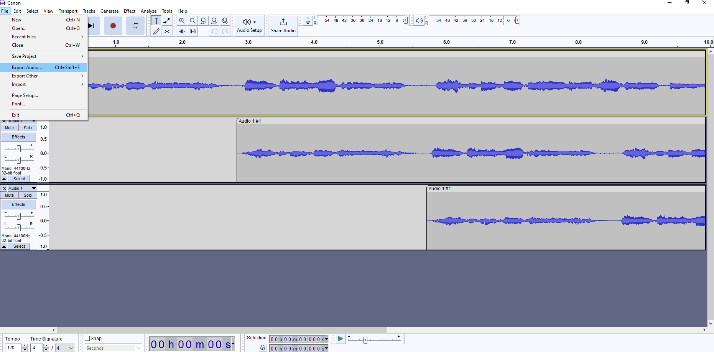
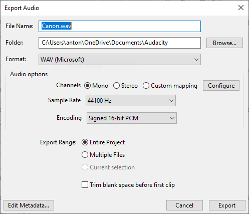
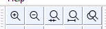

# :book: Grabar un canon musical

1. Abra la aplicación de Audacity.

2. Cree un nuevo proyecto.

    ||
    |:--:|
    | |
    |Fig. 1 Proyecto|

3. Elija uno de los canones publicados por el texto "70 Cánones" de Violeta Hemsy de Gainza.

4. Grabe la voz o parte inicial.

5. Seleccione la parte del audio y haga clic derecho, posteriormente seleccione "**Split Clip**".

    ||
    |:--:|
    | |
    |Fig. 2 Split Clip|

6. Elimine las partes del audio no deseadas.

7. Ahora duplique y triplique el audio original utilizando las funciones de Copy & Paste. `CTRL + C`, `CTRL + V`.

    ||
    |:--:|
    | |
    |Fig. 3 Copy|

    ||
    |:--:|
    | |
    |Fig. 4 Paste|

8. Observe donde termina la primera frase del canon, arrastre la seguna voz desplazandola a la derecha.

    ||
    |:--:|
    | |
    |Fig. 5 Duplicar y triplicar|

    ||
    |:--:|
    | |
    |Fig. 6 Acomodar voz 2|

9. Repita el mismo proceso con la tercera voz.

    ||
    |:--:|
    | |
    |Fig. 7 Acomodar voz 3|

10. Exporte el audio grabado.
 
    - Abra el menú de **File** > **Export Audio...**   

    ||
    |:--:|
    | |
    |Fig. 8 Export Audio|

    - Seleccione el  nombre del archivo y el directorio destino.

    ||
    |:--:|
    | |
    |Fig. 9 File name|

    ' Presione el botón de **Export**   

## Herramientas para edición

- Utilice los botones de acercamiento y alejamiento de ser necesario.

    ||
    |:--:|
    | |
    |Fig. 8 cercar y alejar|

# :books: Referencias
- [Basic Recording, Editing and Exporting](https://manual.audacityteam.org/man/basic_recording_editing_and_exporting.html)