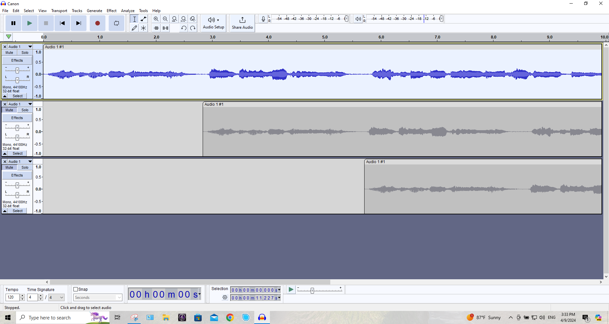
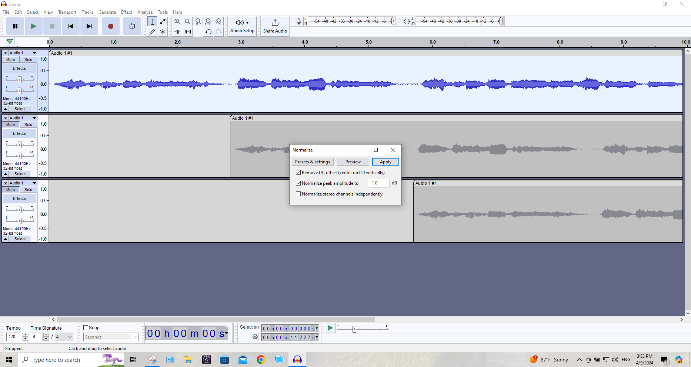
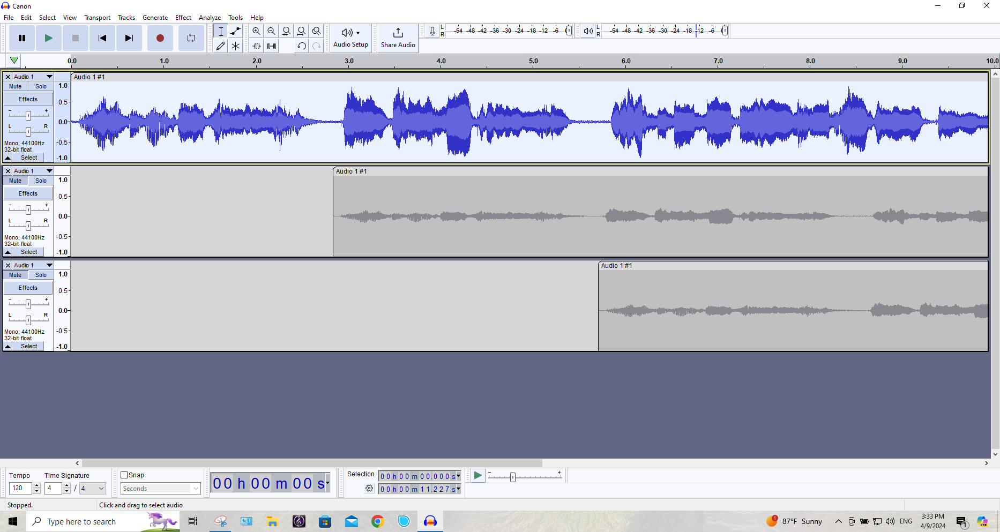
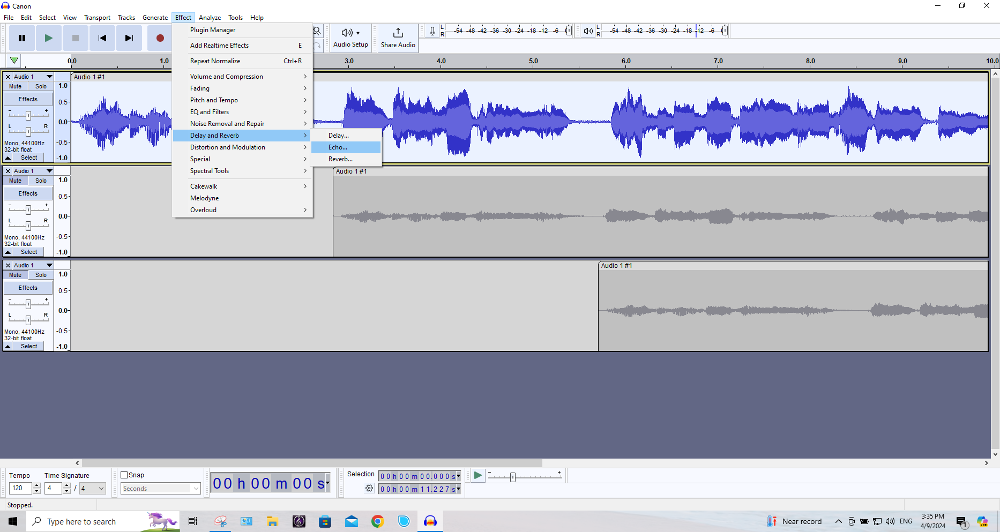
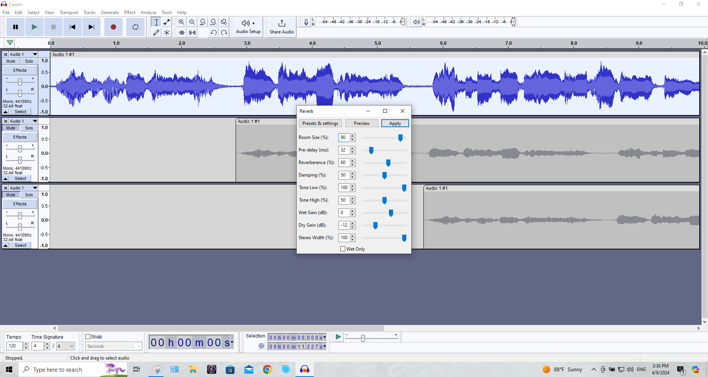

# :book: Agregar efectos de sonido a la grabación

## Descripción
El preente documento está diseñado para aprender a utilizar efectos en un audio grabado, reproducido o editado en la herramienta Audacity.

## Obejtivos
1. Normalizar o ajustar el volumen de un audio grabado.
2. Utilizar los efectos de reberveración, eco o retardo.
3. Descubrir cómo eliminar ruido desde el menú de efectos.

# Pasos

1. Abra la aplicación de Audacity.

2. Abra el último proyecto de audio.

3. Seleccione la pista deseada.

    ||
    |:--:|
    | |
    |Fig. 1 Seleccionar pista|

4. Abra el menú de efectos y seleccione la opción de **Volume and Compression** > **Normalize** (Normalizar).

    ||
    |:--:|
    | |
    |Fig. 2 Efectos > Volumen y compresión > Normalizar|

5. Presione el botón de aplicar.

    ||
    |:--:|
    | |
    |Fig. 3 Aplicar|

6. Ahora el volumen queda ajustado automaticamente. 

    ||
    |:--:|
    | |
    |Fig. 4 Efectos|

7. Abra el menú de **Effect** > **Delay and Reverb** > **Echo...** 

    ||
    |:--:|
    | |
    |Fig. 5 Efectos eco|

8. Presione el botón de **Apply**.

    ||
    |:--:|
    | |
    |Fig. 6 Efectos eco aplicar|

9. Vuelva a abrir el menú de **Effects** (Efectos) y  seleccione la opción **Delay and Reverb** > **Reverb** (Reverberación)

10. Abra el menú de **Effect** > **Delay and Reverb** > **Reverb...** 

    ||
    |:--:|
    | |
    |Fig. 7 Efectos reverberación|

11. Presione el botón de **Apply**.

    ||
    |:--:|
    | |
    |Fig. 8 Efectos reverberación aplicar|

12. Aplique la los efectos a cada una de las pistas o audios grabados.

13. Exporte el audio grabado.
 
    - Abra el menú de **File** > **Export Audio...**   

    ||
    |:--:|
    | |
    |Fig. 9 Export Audio|

    - Seleccione el  nombre del archivo y el directorio destino.

    ||
    |:--:|
    | |
    |Fig. 10 File name|

    - Presione el botón de **Export**   

# :books: Referencias
- [Basic Recording, Editing and Exporting](https://manual.audacityteam.org/man/basic_recording_editing_and_exporting.html)