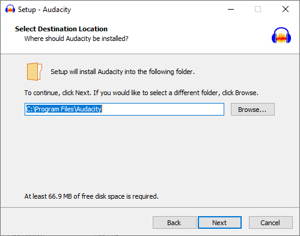
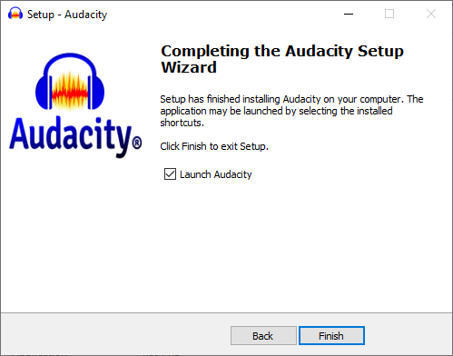
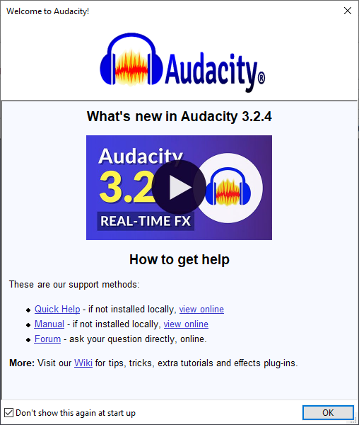

# :book: 1. Instalar Audacity

Para instalar audacity siga los siguientes pasos:

## Windows

1. Abra un navegador e inice una búsqueda por `audacity`.

    ||
    |:--:|
    ||
    |Fig 1. Buscar audacity|

2. Haga click en el vínculo [Audacity ® | Free, open source, cross-platform audio software ...](https://www.audacityteam.org/)

    ||
    |:--:|
    ||
    |Fig 2. Hacer click en [Audacity ® | Free, open source, cross-platform audio software](https://www.audacityteam.org/)|

3. Presione el botón de `DOWNLOAD AUDACITY` (descarga).

    ||
    |:--:|
    ||
    |Fig 3. Iniciar descarga|

4. Elija donde guardar el archivo executable `audacity-win*.exe`.

    ||
    |:--:|
    ||
    |Fig 4. Guardar ejecutable|

5. Inicie archivo ejecutable y en la pantalla _"Do you want to allow this app to make changes to your device"_ responda `Yes`.

    ||
    |:--:|
    ||
    |Fig 5. "Do you want to allow this app to make changes to your device"|

6. Seleccione idioma del instalador.

    ||
    |:--:|
    ||
    |Fig 6. Idioma del instalador|

7. En la página de bienvenida seleccione `Next` (siguiente).

    ||
    |:--:|
    ||
    |Fig 7. Welcome|

8. Acepte la liciencia y continúe `Next`.

    ||
    |:--:|
    ||
    |Fig 8. Licencia|

9.  Elija el directorio destino de instalación y continúe `Next`.

    ||
    |:--:|
    ||
    |Fig 9. Directorio destino|

10. Permita crear acceso directo en su escritorio y continúe `Next`. 

    - [x] Create a desktop shortcut

    ||
    |:--:|
    ||
    |Fig 10. Acceso directo a escritorio|

11. Una vez terminado el proceso de instalación permita lanzar la aplicación.

    - [x] Launch Audacity

    ||
    |:--:|
    ||
    |Fig 11. Lanzar applicación|

12. Acepte verificación de acuatlización y continé `OK`.

    ||
    |:--:|
    ||
    |Fig 12. Verificación de actualización| 

13. Lea la pantalla de bienvenida y continúe `OK`. Si decide que ya no aparezca esa pantalla cada vez que inicie la aplicación, seleccione

    - [x] Don'nt show this again at startup

    ||
    |:--:|
    ||
    |Fig 13. Bienvenida| 

14. Usted verá la pantalla principal de **Audacity**.

    ||
    |:--:|
    ||
    |Fig 13. Bienvenida| 

# :books: Referencias
- [Downloading & installing Audacity](https://support.audacityteam.org/basics/downloading-and-installing-audacity)