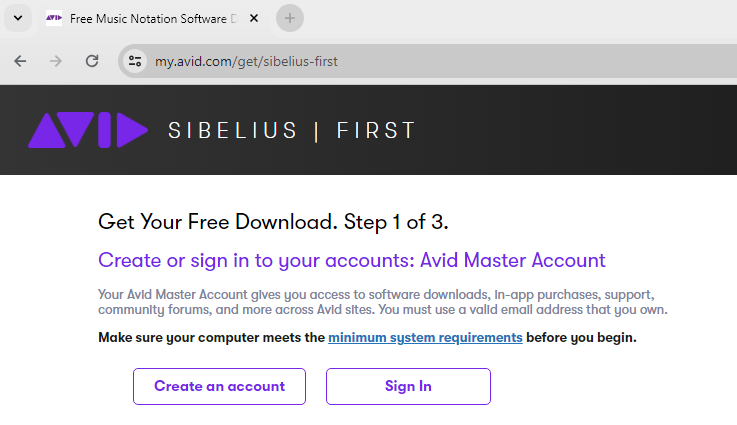
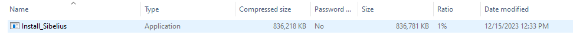
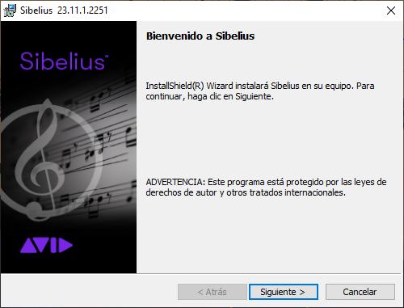
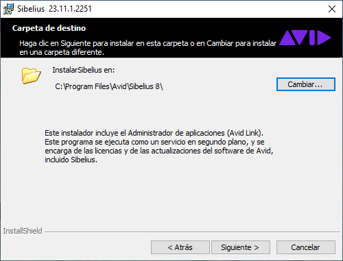
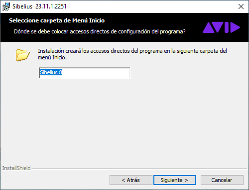
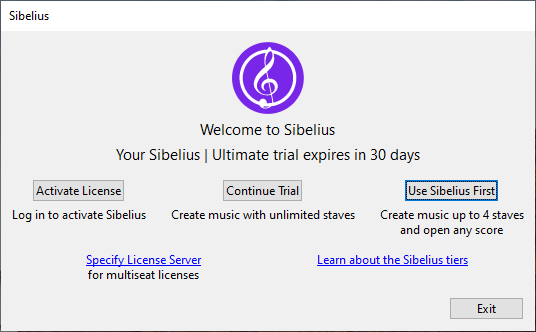

# :book: Instalar Sibelius First

Para instalar sibelius siga los siguientes pasos:

## Windows

1. Abra un navegador y visite el siguiente vínculo [https://my.avid.com/get/sibelius-first](https://my.avid.com/get/sibelius-first) Haga click en el botón de crear cuenta (**Create an account**).

    ||
    |:--:|
    ||
    |Fig 1. Visitar sibelius first|

2. Introduzca los datos del formulario y haga click en enviar (**Submit**).

    ||
    |:--:|
    ||
    |Fig 2. Crear cuenta|

3. Seleccione el propósito de uso y solicite recibir vínculos por correo (**Email my download links**).

    ||
    |:--:|
    ||
    |Fig 3. Enviar formulario|

4. Los vínculos se han enviado a su cuenta de correo electrónico y se le muestra la confirmación en pantalla.

    ||
    |:--:|
    ||
    |Fig 4. Confirmación de envío|

5. Abra su correo y búsque el mensaje de Avid. Después haga click en la versión del instalador, ya sea para la plataforma de **Windows** o  **Mac**.

    ||
    |:--:|
    ||
    |Fig 5. Correo de descarga del producto|

6. Una vez que se complete la descarga, abra el archivo del instalador: `Sibelius_yyyy.xx.x_Win`.

    ||
    |:--:|
    ||
    |Fig 6. Abra archivo del instalador|

7. Ejecute el archio de instalación: `Install_Sibelius`.

    ||
    |:--:|
    ||
    |Fig 7. Ejecute instalador de Sibelius|

8. Permta que se ejecute la aplicación presionando el botón de `Yes`.

    ||
    |:--:|
    ||
    |Fig 8. Acepte ejecución del instalador|

9.  Seleccione el lenguaje de instalación `Spanish` (Español) y continúe `OK`.

    ||
    |:--:|
    ||
    |Fig 9. Seleccione lenguaje de instalación|

10. Presione el botón de `Siguiente >` en la ventana de **Bienvenida a Sibelius**. 

    ||
    |:--:|
    ||
    |Fig 10. Bienvenida|

11. Acepte la licencia seleccionando la opción de `Acepto los términos del contrato de licencia` y presione el botón de `Siguiente >`.

    ||
    |:--:|
    ||
    |Fig 11. Licencia|

12. Continue presionando el botón de `Siguiente >`.

    ||
    |:--:|
    ||
    |Fig 12. Carpeta destino| 

13. Continue presionando el botón de `Siguiente >`.

    ||
    |:--:|
    ||
    |Fig 13. Menú de inicio| 

14. Ahora presione el botón de **Instalar**.

    ||
    |:--:|
    ||
    |Fig 14. Instalar| 

15. El proceso de instalación comienza.

    ||
    |:--:|
    ||
    |Fig 15. Instalando| 

16. Terminado el proceso de instalación seleccione `Ejecutar programa` y presione el botón de `Finalizar`.

    ||
    |:--:|
    ||
    |Fig 16. Finalizar| 

17. Seleccone la opción de `Use Sibelius First`.

    ||
    |:--:|
    ||
    |Fig 17. Sibelius First| 

18. La aplicación de **Sibelius First** se ejecuta exitosamente.

    ||
    |:--:|
    ||
    |Fig 18. Sibelius First| 

# :books: Referencias

- [Sibelius Software Installation Guide](https://resources.avid.com/SupportFiles/Sibelius/2018.6/Sibelius_Installation_2018.6.pdf)