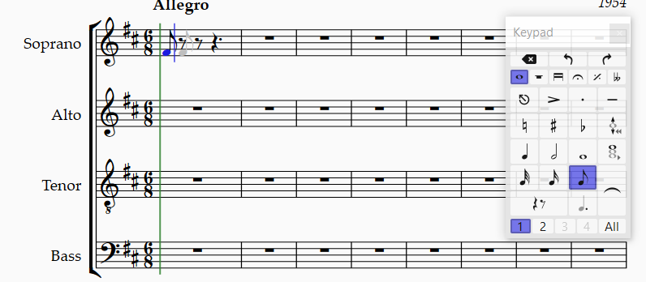
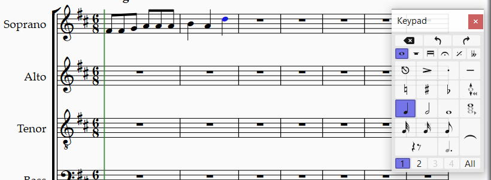
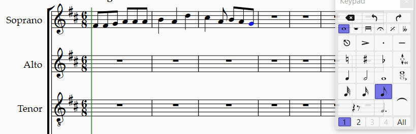
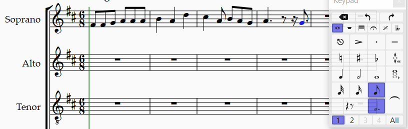

<!-- Header -->
CEDART José Clemente Orozco - Mtro. Antonio Salazar Gómez | Copyright :copyright: Febrero de 2024

# :book: Introducir notas

Para introducir notas en la partitura coral siga los pasos que se describen a continuación.

> Como requisito debe haber completado los pasos descritos en [Editar el encabezado de la partitura](./03_editar_encabezado.md).

## Objetivo

Introducir las notas correspndientes a la frase que dice: "¡Quién cabalgara el caballo de espuma azul de la mar!".

# Procedimiento

1. Seleccione el [Teclado flotante](../../tareas_comunes/mostrar_teclado_flotante.md) (Keypad).

2. Presione la tecla (**F7**) y posteriormente el número (**3**) del teclado numérico. 

   - **(F7)** corresponde a la página de **Common notes** (Notas comunes).
   - EL número **(3)** del teclado numérico corresponde a la corchea.

3. El puntero del ratón (mouse) se torna azul, al mismo tiempo modifica su forma al de una nota corchea. Ahora en el pentagrana de la **Soprano**, poisicione el puntero del ratón (mouse) a la nota **Fa4** y haga clic en el primer tiempo del primer compás.

    ||
    |:--:|
    ||
    |Fig. 1 Introducir nota|

4. Presione la tecla `R` para repetir la nota anterior. En este caso **Fa4**. Continue presionando `R` hasta completar las seis notas corcheas del primer compás. 

5. Cambie la afinación de las notas, según aparecen en la partitura original. Para cambiar la afinación (altura) de las notas utilice las flechas del teclado de la siguiente manera:

    |||
    |--|--|
    |:arrow_left:|Selecciona nota anterior|
    |:arrow_right:|Selecciona nota siguiente|
    |:arrow_up:|Modifica afinación por grado ascendente|
    |:arrow_down:|Modifica afinación por grado descendente|

    ||
    |:--:|
    ||
    |Fig. 2 Cambiar afinación de las notas|

6. Para introducir las notas del segundo compás realice los siguientes pasos:

      - De clic con el ratón (mouse) sobre el segundo compás.
      - Presione el número (4) del teclado numérico para seleccionar la figura **Negra**. 
      - Teclee la secuencia: `B`, `A`, y `D` que corresponden a las notas **Si4**, **La4** y **Re5**.

    ||
    |:--:|
    ||
    |Fig. 3 Introducir notas del segundo compás|

7. Siguiendo la lógica anterior, introduzca las notas del tercer compás.

    ||
    |:--:|
    ||
    |Fig. 4 Introducir notas del tercer compás|

8. Seleccione el cuarto compás, después presione las teclas:

   - Número (4) del teclado numérico. (=> Negra <=)
   - Punto (.) del teclado numérico. (=> Puntillo <=)
   - Letra (`A`) del teclado. (=> **La4** <=)
   - Flecha derecha :arrow_right: (=> Siguiente nota <=)
   - Número (3) del teclado numérico. (=> Corchea <=)
   - Flecha derecha :arrow_right: (=> Siguiente nota <=)
   - Número (2) del teclado numérico. (=> Semicorchea <=)
   - Flecha derecha :arrow_right: (=> Siguiente nota <=)
   - Número (3) del teclado numérico. (=> Corchea <=)
   - Punto (.) del teclado numérico. (=> Puntillo <=)
   - Letra (`G`) del teclado. (=> **Sol4** <=)

    ||
    |:--:|
    ||
    |Fig. 5 Introducir notas del cuarto compás|

# :books: Referencias
- [Sibelius ® Guía de referencia](https://resources.avid.com/SupportFiles/Sibelius/8.4/L10N/ES/reference.pdf)

### Ir a la Página...
|||
|:--|--:|
| :arrow_backward: [Anterior](./03_editar_encabezado.md)|[Siguiente](./05_introducir_texto.md) :arrow_forward:|
