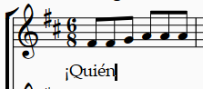
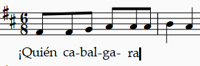
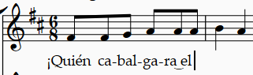
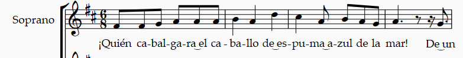
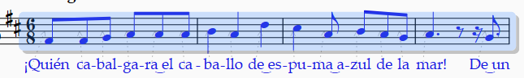
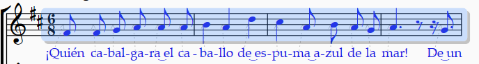
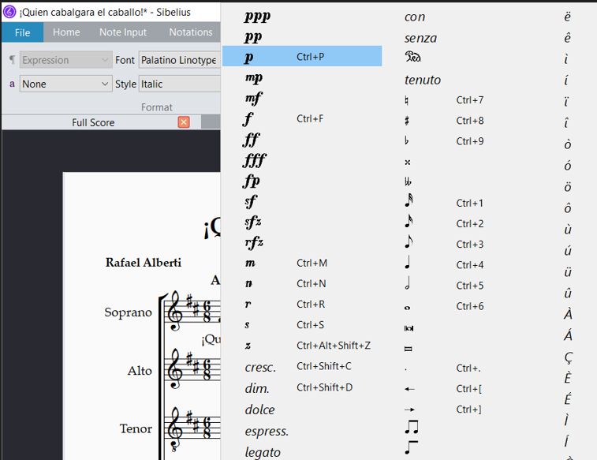

<!-- Header -->
CEDART José Clemente Orozco - Mtro. Antonio Salazar Gómez | Copyright :copyright: Febrero de 2024

# :book: Introducir texto

Para introducir texto debajo de las notas en la partitura coral siga los pasos que se describen a continuación.

> Como requisito debe haber completado los pasos descritos en [Introducir notas](./04_introducir_notas.md).

## Objetivo

Introducir el texto que dice: "¡Quién cabalgara el caballo de espuma azul de la mar!".

# Procedimiento

## Introducir texto de la primera frase

1. Seleccione la primera nota del primer compás en la parte de la Soprano.

2. Elija la pestaña **Text** (Texto), después el menú **Lyrics** (Letra), y finalmente **Lyrics line 1** (Texo línea 1). También puede utilizar el atajo `CTLR + L`.
    
    ||
    |:--:|
    ||
    |Fig. 1 Letra 1|

3. El cursor comenzará a parpadear debajo de la nota. Ahora escriba el texto `¡Quién`.

    ||
    |:--:|
    ||
    |Fig. 2 ¡Quién|

4. Para avanzar a la siguiente nota presione la barra espaciadora.

5. Ahora introduzca la sílaba `ca` y después el símbolo de guión medio (`-`). Esto permite avanzar a la siguiente nota.

6. Continúe con las siguientes sílabas hasta terminar de escribir la palabra "cabalgara". 

    - Así es que para introducir la palabra completa siga la secuencia siguiente: `ca` `-` `bal` `-` `ga` `-` `ra`.

    ||
    |:--:|
    ||
    |Fig. 3 ¡Quién ca-bal-ga-ra|

7. Para unir las sílabas `ra` con `el` presione el guión bajo (`_`). Ejemplo: `ra` `_` `el`. Después presione la barra espaciadora para continuar con la siguiente nota.

    ||
    |:--:|
    ||
    |Fig. 4 ¡Quién ca-bal-ga-ra_el|

8. Proceda a escribir la palabra "caballo" escribiendo la secuencia: `ca` `-` `ba` `-` `llo` y presione la barra espaciadora para avanzar a la siguiente nota.

9. Ahora escriba las sílabas: `de` `_` `es` `-` `pu` `-` `ma` `_` `a` `-` `zul`. Recuerde que el guión medio une dos sílabas en distintas notas, mientras que el guión bajo une dos sílabas en la misma nota.

    ||
    |:--:|
    ||
    |Fig. 5 ¡Quién ca-bal-ga-ra_el ca-ba-llo de_es-pu-ma_a-zul |

10. Finalmente escriba la secuencia: `de` espacio `la` espacio `mar!` espacio `De` `_` `un`. 

    ||
    |:--:|
    ||
    |Fig. 6 ¡Quién ca-bal-ga-ra_el ca-ba-llo de_es-pu-ma_a-zul de la mar! De_un|

## Separar los corchetes

1. Seleccione los primeros cuatro compases.

    ||
    |:--:|
    ||
    |Fig. 7 Seleccionar cuatro compases|

2. Abra el [teclado flotante](../../tareas_comunes/mostrar_teclado_flotante.md) y presione (F9) Barras/Trémolos.

3. Ahora presione el número 7 del teclado numércio o de clic sobre el ícono No beam (sin corchete).

    ||
    |:--:|
    ||
    |Fig. 8 Barras/Trémolos|

4. Los corchetes ahora deben aparecer separados.

    ||
    |:--:|
    ||
    |Fig. 9 Sin corhete|

## Introducir las dinámicas

1. Seleccione la primera nota del primer compás de la Soprano **Fa4**.

2. En la pestaña **Texo**, seleccione **Expression** (expresión).

    ||
    |:--:|
    ||
    |Fig. 10 Menú de expresión|

3. El cursor parpadeará sobre la nota. Ahora de clic derecho sobre el cursor.

    ||
    |:--:|
    ||
    |Fig. 11 Seleccionar nota|

4. El menú de expresión se abrirá, entonces seleccione la dinámica ***p*** piano.

    ||
    |:--:|
    ||
    |Fig. 12 Opciones de expresión|

5. Ahora la nota **Fa4** aparece con la dinámica ***p***.

    ||
    |:--:|
    ||
    |Fig. 13 Dinámica ***p***|

> El método corto para establecer dinámicas es:
> 1. Seleccionar la nota.
> 2. Teclear `CTRL + E` después `CTRL + P`. 

## Copiar compases

> Encuentre más información sobre [copiar y pegar aquí](../../tareas_comunes/copiar_y_pegar.md).

1. Seleccione los primeros cuatro compases de la soprano.

    ||
    |:--:|
    ||
    |Fig. 14 Seleccionar compases|

2. Presione las teclas `CTRL + C` o seleccione la pestaña de Home, y después el botón de 📄 Copy (copiar) en el menú de Clipboard (portapapeles).

3. Seleccione el primer compás de la Alto y presione las teclas `CTRL + V` o en la pestaña de Home (inicio), y de clic en el botón de 📋 Paste (pegar) en el menú de Clipboard (portapapeles).

4. Ahora presione dos veces la flecha hacia abajo (:arrow_down: + :arrow_down:) para modificar la afinación de la Alto.

    ||
    |:--:|
    ||
    |Fig. 15 Copiar compases|

# :books: Referencias
- [Sibelius ® Guía de referencia](https://resources.avid.com/SupportFiles/Sibelius/8.4/L10N/ES/reference.pdf)

### Ir a la Página...
||
|:--|
| :arrow_backward: [Anterior](./04_introducir_notas.md)|
