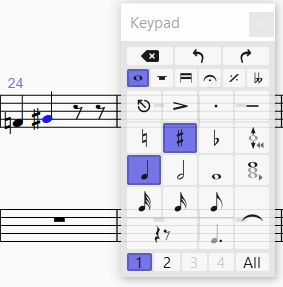

<!-- Header -->
CEDART José Clemente Orozco - Mtro. Antonio Salazar Gómez | Copyright :copyright: Febrero de 2024

# :musical_note: Accidentes, Corchetes y Fermatas

## Accidentes

Para introducir accidentes realice los siguientes pasos:

1. Seleccione el **Keypad** (Teclado flotante) y presione **F7**.

2. Seleccione la figura que tiene el accidente, en el siguiente ejemplo la negra.

3. Seleccione becuadro, sostenido, o bemol en el Keypad (teclado flotante).

4. Introduzca la nota en el pentagrama. 

    ||||
    |:--:|:--:|:--:|
    ||||
    |Fig. 1 Fa4 becuadro|Fig. 2 Sol4 sostenido|Fig. 3 La4 bemol|

## Corchetes

### Separar

1. Seleccione el grupo de notas con corchetes.
2. Abra el **Keypad** (Teclado flotante) y presione **F7**.
3. Presione el botón de **No beam** (sin corchete).

    ||
    |:--:|
    ||
    |Fig. 4 Sin corchetes|

### Unir

1. Seleccione el grupo de notas sin corchetes.
2. Abra el **Keypad** (Teclado flotante) y presione **F7**.
3. Presione el botón de **Middle beam** (corchete medio).

    ||
    |:--:|
    ||
    |Fig. 5 Con corchetes|

## Fermatas

1. Abra el **Keypad** (Teclado flotante) y presione **F7**.
2. Introduzca las notas que requieren fermata o calderón.

    ||
    |:--:|
    ||
    |Fig. 6 Intrducir notas|

3. Seleccione nuevamente el **Keypad** (Teclado flotante) y presione **F10**.
4. En el pentagrama seleccione las notas que requieren fermata (calderón).
5. Presionen el botón de fermata (calderón).

    ||
    |:--:|
    ||
    |Fig. 7 Fermata|

# :books: References

- [Sibelius ® Guía de referencia](https://resources.avid.com/SupportFiles/Sibelius/8.4/L10N/ES/reference.pdf)

- [Sibelius ® Reference Guide](https://resources.avid.com/SupportFiles/Sibelius/8.2/reference.pdf)