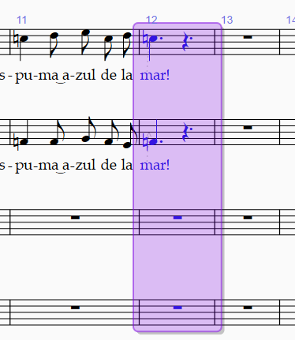

<!-- Header -->
CEDART José Clemente Orozco - Mtro. Antonio Salazar Gómez | Copyright :copyright: Febrero de 2024

# :wastebasket: Borrar

## Borrar notas

1. [Seleccione las notas](./seleccionar.md) o grupo de notas que desea eliminar.

2. Después presione cualquiera de las teclas de `Suprimir`.

## Borrar compás

1. Mientras presiona la tecla `CTRL` haga clic con el mouse en el centro del pentagrama sobre el compás que desea borrar.

2. Los compases se tornarán de color violeta o morado.

    ||
    |:--:|
    ||
    |Fig. 1 Seleccionar especial|

3. Después presione cualquiera de las teclas de `Suprimir`.

Las teclas de suprimir cambian de nombre dependiendo del idioma y del teclado.

Por ejemplo:
- En Español se llaman: `Suprimir` o `Borrar`.
- En inglés se llaman: `Backspace` o `Delete`.
- También aparece como :back:

# :books: References

- [Sibelius ® Guía de referencia](https://resources.avid.com/SupportFiles/Sibelius/8.4/L10N/ES/reference.pdf)

- [Sibelius ® Reference Guide](https://resources.avid.com/SupportFiles/Sibelius/8.2/reference.pdf)