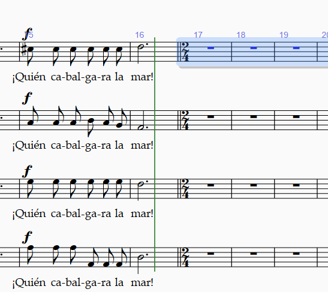

<!-- Header -->
CEDART José Clemente Orozco - Mtro. Antonio Salazar Gómez | Copyright :copyright: Febrero de 2024

# :game_die: Cambio de Compás

Los pasos para cambiar el compás se describen a continuación:

1. Seleccione el compás o grupo de compases que tendrán un nuevo compás.
2. Abra la pestaña de **Notations** (Notaciones).
3. Haga clic sobre el menú de **Time Signature** (Compás).
4. Elija el nuevo compás deseado.

    ||
    |:--:|
    ||
    |Fig. 1 Seleccionar nuevo compás|

5. El nuevo compás se mostrará en el grupo de compases seleccionados.

    ||
    |:--:|
    ||
    |Fig. 2 Mostrar nuevo compás|

# :books: References

- [Sibelius ® Guía de referencia - 4.3 Indicaciones de compás](https://resources.avid.com/SupportFiles/Sibelius/8.4/L10N/ES/reference.pdf)

- [Sibelius ® Reference Guide - 4.3 Time signatures](https://resources.avid.com/SupportFiles/Sibelius/8.2/reference.pdf)