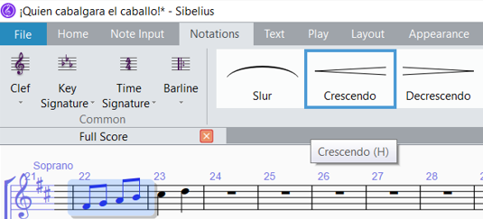
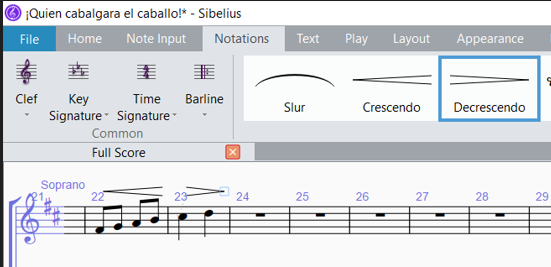
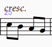
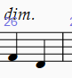

<!-- Header -->
CEDART José Clemente Orozco - Mtro. Antonio Salazar Gómez | Copyright :copyright: Febrero de 2024

# :level_slider: Dinámicas y Símbolos de Expresión

Para introducir las dinámicas y símbolos de expresión realice los siguientes pasos:

1. Seleccione la nota deseada.

2. Teclee `CTRL + E`.

3. El cursor parpadeará sobre la nota, por tanto dé clic derecho para desplegar el menú de dinámicas y símbolos de expresión.

    ||
    |:--:|
    ||
    |Fig. 1 `CTRL + E`|

4. Elija el símbolo de dinámicas o de expresión deseado.

    ||
    |:--:|
    ||
    |Fig. 2 Menú de dinámicas y de expresión|

5. Ahora la dinámica se mostrará sobre la nota seleccionada.

    ||
    |:--:|
    ||
    |Fig. 3 Dinámica escrita en nota|

## Accesos directos más comunes

|Dinámica o expresión|Combinación de teclas|
|:--:|:--|
|***p***|`CTRL + E` + `CTRL + P`|
|***mp***|`CTRL + E` + `CTRL + M` + `CTRL + P`|
|***mf***|`CTRL + E` + `CTRL + M` + `CTRL + F`|
|***f***|`CTRL + E` + `CTRL + F`|
|***cresc.***|`CTRL + E` + `CTRL + Mayus + C`|
|***dim.***|`CTRL + E` + `CTRL + Mayus + D`|

## Símbolos de Crescendo y Diminuendo

1. Abra la pestaña de **Notations** (Notaciones).

2. Seleccione el grupo de notas deseadas.

3. Haga clic sobre el símbolo de cresendo.

    ||
    |:--:|
    ||
    |Fig. 4 Crescendo|

5. Repita el mismo proceso para el símbolo de diminuendo.

    ||
    |:--:|
    ||
    |Fig. 5 Diminuendo|

- Para introducir el texto **cresc.** siga los siguientes pasos:
  - Seleccione la nota deseada.
  - Presione `CTRL + E` 
  - Después `CTRL + Mayus + C`.

    ||
    |:--:|
    ||
    |Fig. 6 cresc.|

- Para introducir el texto **dim.** siga los siguientes pasos:
  - Seleccione la nota deseada.
  - Presione `CTRL + E` 
  - Después `CTRL + Mayus + D`.

    ||
    |:--:|
    ||
    |Fig. 7 dim.|

# :books: References

- [Sibelius ® Guía de referencia](https://resources.avid.com/SupportFiles/Sibelius/8.4/L10N/ES/reference.pdf)

- [Sibelius ® Reference Guide](https://resources.avid.com/SupportFiles/Sibelius/8.2/reference.pdf)
