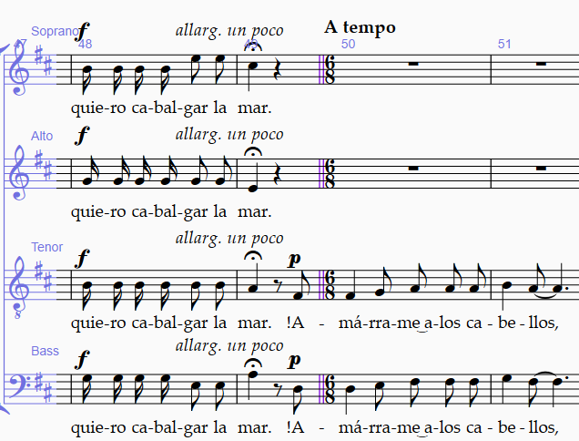

<!-- Header -->
CEDART José Clemente Orozco - Mtro. Antonio Salazar Gómez | Copyright :copyright: Febrero de 2024

# :compass: Estilo de barra de compás

Ejecute los siguientes pasos para cambiar el estilo de la barra de compás.:

1. Haga clic sobre la barra de compás. Esta debe tornarse de color púrpura.

2. Seleccione el menú de **Notations** (Notaciones).

3. Abra el menú de **Barline** (Estilo de barra de compás).

    ||
    |:--:|
    ||
    |Fig. 1 Estilo barra de compás|

4. Elija el estilo de barra deseado.

    ||
    |:--:|
    ||
    |Fig. 1 Estilo de barra de compás seleccionado|

# :books: References

- [Sibelius ® Guía de referencia - 4.5 Barras de compás](https://resources.avid.com/SupportFiles/Sibelius/8.4/L10N/ES/reference.pdf)

- [Sibelius ® Reference Guide - 4.5 Barlines](https://resources.avid.com/SupportFiles/Sibelius/8.2/reference.pdf)