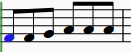
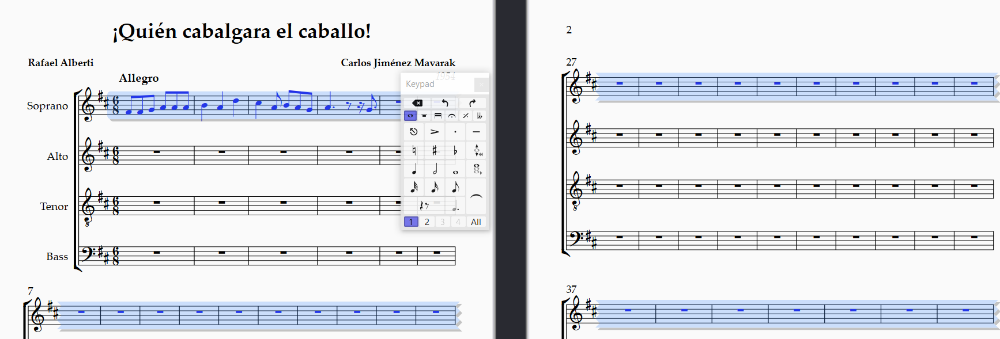

<!-- Header -->
CEDART José Clemente Orozco - Mtro. Antonio Salazar Gómez | Copyright :copyright: Febrero de 2024

# :pencil: Seleccionar

Para seleccionar los objetos en Sibelius realice los siguientes pasos:

- **Una nota**: haga clic sobre la nota a seleccionar. Ésta se debe colorear de azul.

    ||
    |:--:|
    ||
    |Fig. 1 Seleccionar nota|

  
- **Varias notas**: haga clic sobre la primera nota, después mientras sostiene la tecla Mayus (Shift), presione la flecha derecha :arrow_right: para continuar la selección. Las notas seleccionadas se colorean de azul.

    ||
    |:--:|
    ||
    |Fig. 2 Seleccionar notas|

- **Un compás**: haga clic sobre la el centro del pentagrama que desea seleccionar. Éste se debe colorear de azul.

- **Varios compases**: haga clic sobre centro del pentagrama que desea seleccionar. Después mientras sostiene la tecla Mayus (Shift), presione la flecha derecha :arrow_right: para continuar la selección. Los compases seleccionados se colorean de azul. 

    ||
    |:--:|
    ||
    |Fig. 3 Seleccionar varios compases|

- **Todos los compases**: haga triple clic sobre el centro de un pentagrama. Todos los pentagramas se colorearán de azul.

    ||
    |:--:|
    ||
    |Fig. 4 Seleccionar todos los compases|

- **Un sistema**: haga clic sobre el centro de un penagrama. Después mientras sostiene la tecla Mayus (Shift), dé clic sobre el centro de otro pentagrama distinto.

    ||
    |:--:|
    ||
    |Fig. 5 Seleccionar un sistema|

# Seleccionar especial

En ocasiones es necesario realizar una selección de compás para posteriormente elimintarlo.

Mientras presiona la tecla `CTRL` haga clic con el mouse en el centro del pentagrama sobre el compás que desea borrar.

Los compases se tornarán de color violeta o morado.

||
|:--:|
||
|Fig. 6 Seleccionar especial|

# :books: References

- [Sibelius ® Guía de referencia - Trabajar con la cinta de opciones](https://resources.avid.com/SupportFiles/Sibelius/8.4/L10N/ES/reference.pdf)

- [Sibelius ® Reference Guide - Working with the ribbon](https://resources.avid.com/SupportFiles/Sibelius/8.2/reference.pdf)