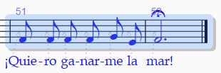
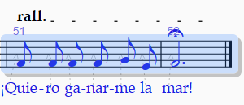

<!-- Header -->
CEDART José Clemente Orozco - Mtro. Antonio Salazar Gómez | Copyright :copyright: Febrero de 2024

# :mantelpiece_clock: Tempo

Para introducir el texto del tempo realice los siguientes pasos:

1. Seleccione el compás deseado.

    ||
    |:--:|
    ||
    |Fig. 1 Seleccionar compás|

2. Presione las teclas `CTRL + ALT + T`.

3. El cursor comenzará a parpadear, por tanto, dé clic derecho.

    ||
    |:--:|
    ||
    |Fig. 2 Clic derecho|

4. Elija el texto de **Tempo** deseado del menú.
  
    ||
    |:--:|
    ||
    |Fig. 3 Tempo|

## Ritardando y Accelerando

Para introducir los textos ritardando o accelerando realice los siguientes pasos:

1. Seleccione el grupo de compases deseados.

    ||
    |:--:|
    ||
    |Fig. 4 Selección de compases|

2. Abra el menú **Notations** (Notaciones) y seleccione la opción ***Rit. and Accel.***

3. Elija la opción deseada.

    ||
    |:--:|
    ||
    |Fig. 5 Intrducir notas|

4. El cambió será establecido en la partitura.
   
    ||
    |:--:|
    ||
    |Fig. 6 Intrducir notas|

    ||
    |:--:|
    ||
    |Fig. 7 Intrducir notas|

# :books: References

- [Sibelius ® Guía de referencia](https://resources.avid.com/SupportFiles/Sibelius/8.4/L10N/ES/reference.pdf)

- [Sibelius ® Reference Guide](https://resources.avid.com/SupportFiles/Sibelius/8.2/reference.pdf)
