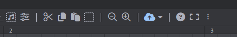
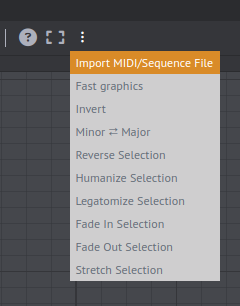
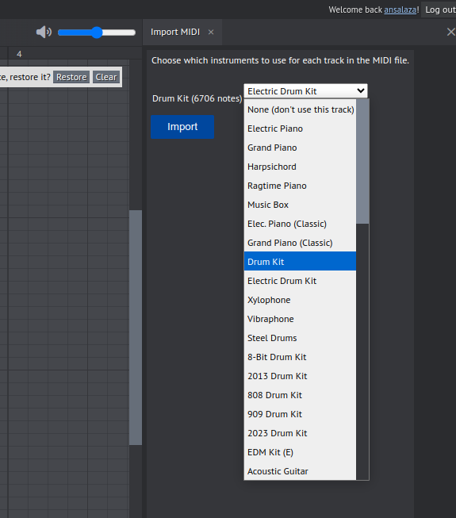
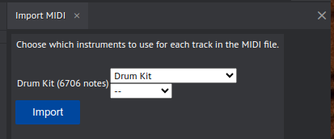

# Importar un archivo MIDI

Para importar un archivo MIDI siga los siguientes pasos.

1. Haga click sobre el menú **More Tools**. (tres puntos)

||
|:--:|
||

2. Seleccione la opción **Import MIDI/Sequence File**

||
|:--:|
||

3. Abra el menú ded instrumentos y elija **Drum Kit**.

||
|:--:|
||

4. Presione el botón de **Import**. 

||
|:--:|
||
