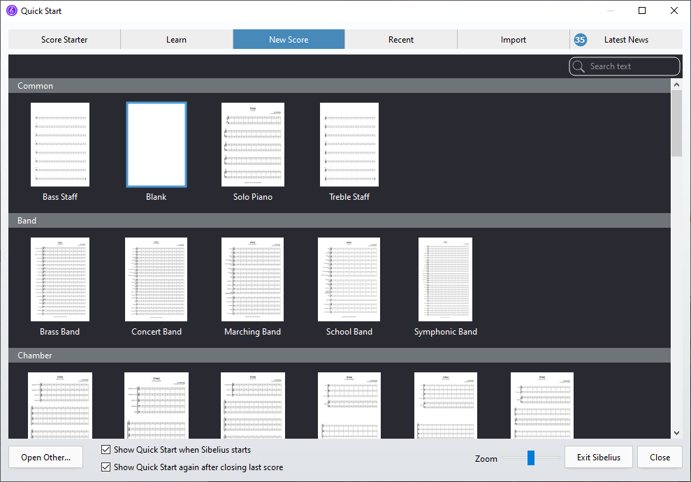
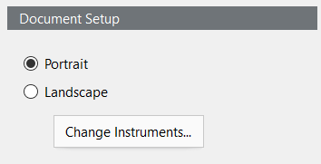
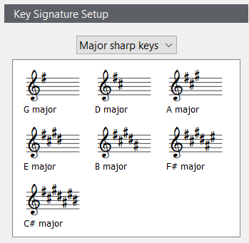
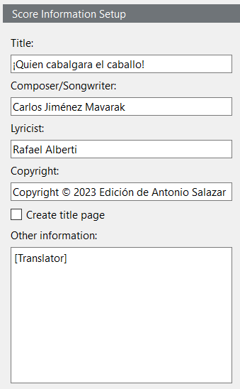

<!-- Header -->
CEDART José Clemente Orozco - Mtro. Antonio Salazar Gómez | Copyright :copyright: Febrero de 2024

# :book: Crear una partitura coral

A continuación se describen los pasos para crear una partitura coral en **SIbelius First**.

> Como requisito debe haber comprendido lo descrito en [Acerca del proyecto](./01_acerca_del_proyecto.md).

## Procedimiento

1. Abra la aplicación **Sibelius First**.

    ||
    |:--:|
    ||
    |Fig. 1 Abrir sibelius first|

2. Seleccione la pestaña **New Score** (*Nueva Partitura*).

    ||
    |:--:|
    ||
    |Fig. 2 Nueva partitura| 

3. Navegue hasta encontrar la sección **Choral** (*Coral*), y sleccione la plantilla para **SATB a cappella**.

    ||
    |:--:|
    ||
    |Fig. 3 Seleccionar SATB a cappella| 

4. Se abrirá la pantalla de configuración de la partitura. Por favor introduzca los siguientes datos:

    ||
    |:--:|
    ||
    |Fig. 4 Configuración de documento| 

    > Seleccione las opciones señaladas.

- **Document Setup** (Formato del documento): 
  - *Portrait (Vertical)* :point_left:
  - Landscape (Horizontal)

    ||
    |:--:|
    ||
    |Fig. 5 Formato de documento| 

- **Time Signature Setup** (Configuración del compás y el tempo)
  - **Time Signature (Compás)**: 
    - *6/8* :point_left:
  - Pick-up (Upbeat) Bar (Anacrusa) 
    - Sart with bar length (dejar en blanco)
  - **Tempo**
    - Tempo text: *Allegro* :point_left:
    - Metronome mark (marca de metrónomo) (dejar en blanco)

    ||
    |:--:|
    ||
    |Fig. 6 Tempo| 

- **Key Signature Setup** (Armadura)
  - D major (Re mayor) :point_left:

    ||
    |:--:|
    ||
    |Fig. 7 Tonalidad| 

- **Score Information Setup** (Configuraci[on de la partitura)
  - Title (Título): "*¡Quien cabalgara el caballo!*" :point_left:
  - Composer/Songwriter (Compositor): "*Carlos Jiménez Mavarak*" :point_left:
  - Lyricist (Letrista): "*Rafael Alberti*" :point_left:
  - Copyright: "*Escriba su nombre, y fecha de edición*" :point_left:
  - Create title page (dejar en blanco)
  - Other Information: (dejar en blanco)

    ||
    |:--:|
    ||
    |Fig. 8 Información de la partitura| 

5. Presione el botón **Create** (Crear)

6. Proceda a [guardar la partitura](tareas_comunes/guardar_partitura.md)

# :books: Referencias
- [Sibelius ® Guía de referencia](https://resources.avid.com/SupportFiles/Sibelius/8.4/L10N/ES/reference.pdf)

### Ir a la Página...
|||
|:--|--:|
|:arrow_backward: [Anterior](./01_acerca_del_proyecto.md)|[Siguiente](./03_editar_encabezado.md) :arrow_forward:|

