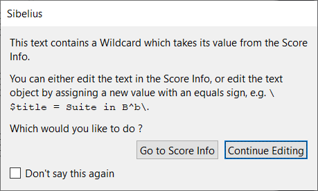
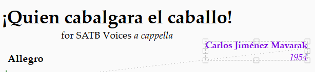

<!-- Header -->
CEDART José Clemente Orozco - Mtro. Antonio Salazar Gómez | Copyright :copyright: Febrero de 2024

# :book: Editar el encabezado de la partitura

Para editar el encabezado de la partitura coral siga los pasos que se describen a continuación.

> Como requisito debe haber completado los pasos descritos en [Crear una partitura coral](./02_crear_partitura_coral.md).

## Procedimiento

1. Haga doble clic sobre el nombre del compositor.
2. En la ventana emergente, seleccione **Continue Editing** (*Continuar Editando*).
    
    ||
    |:--:|
    ||
    |Fig. 1 Continue Editing|

3. Reemplaze el texto de `Arranged by \$Arranger=[Arranger]\` por `1954`, que es la fecha de composición de la música.

4. Presiona la tecla de escape `ESC`, o haga clic en otra parte de la pantalla para terminar el modo de edición del texto.

    ||
    |:--:|
    ||
    |Fig. 2 Ajuste sobre el compositor|

5. Repita el mismo procedimiento para eliminar el texto `Translated by \$MoreInfo=\`.

    ||
    |:--:|
    ||
    |Fig. 3 Ajuste sobre el letrista|

6. Ahora edite el Título agregando el acento en la palabra `Quién`.
 
7. Finalmente haga lo propio para eliminar el subtítulo `\$Subtitle=for SATB Voices \I\a cappella\i\\`.

El encabezado debe parecerse a la siguiente figura.

||
|:--:|
||
|Fig. Encabezado final|

# :books: Referencias
- [Sibelius ® Guía de referencia](https://resources.avid.com/SupportFiles/Sibelius/8.4/L10N/ES/reference.pdf)

### Ir a la Página...
|||
|:--|--:|
| :arrow_backward: [Anterior](./02_crear_partitura_coral.md)|[Siguiente](./04_introducir_notas.md) :arrow_forward:|

