<!-- Header -->
CEDART José Clemente Orozco - Mtro. Antonio Salazar Gómez | Copyright :copyright: Febrero de 2024

# :book: Transcribir una partitura de piano

A continuación se describen los pasos para transcribir la partitura de piano en **SIbelius First**.

> Como requisito debe haber comprendido lo descrito en [Acerca del proyecto](./01_acerca_del_proyecto.md).

## Procedimiento

1. Abra la aplicación **Sibelius First**.

2. Seleccione la pestaña **New Score** (*Nueva Partitura*).

3. Navegue hasta encontrar la sección **Solo Piano**.

    ||
    |:--:|
    |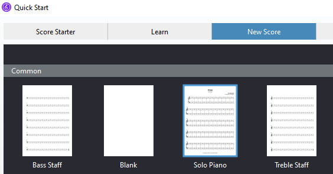|
    |Fig. 1 Solo Piano|

4. Se abrirá la pantalla de configuración de la partitura. Introduzca los siguientes datos:

   - **Time signature** (compás)
   - Oprima el botón de **Other...** (Otro)
   - Seleccione la opción de **Other... 4/1** :point_left: y presione el botón de **OK**.
  
    ||
    |:--:|
    |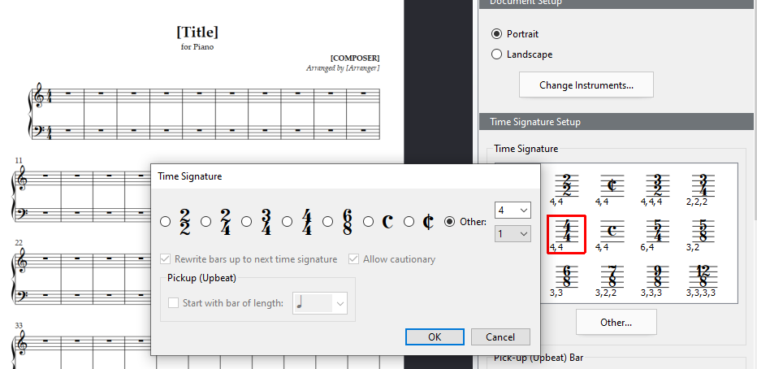|
    |Fig. 2 Time Signature (compás)| 

   - **Tempo text: Lento**.

    ||
    |:--:|
    ||
    |Fig. 3 Tempo| 

   - Seleccione la tonalidad de Fa menor.
   - Introduzca Título, compositor y Copyright.
  
    ||
    |:--:|
    |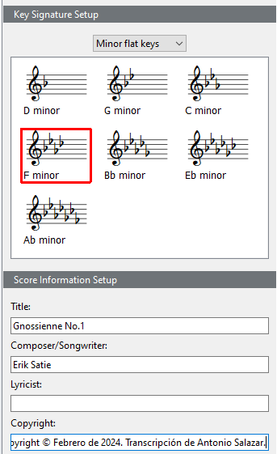|
    |Fig. 4 Tonalidad, título, compositor y copyright| 

5. Edite el encabezado.
 
    ||
    |:--:|
    |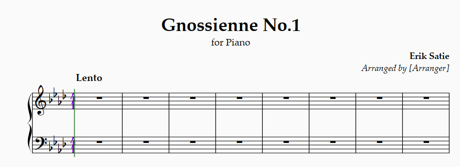|
    |Fig. 5 Editar encabezado| 

6. Seleccione el pentagrama de la clave de Fa, e introduzca las primeras cuatro notas del bajo.

7. Después posicione el cursor en el primer pentagrama de la clave de sol.

8. Abra el **Keytab** (teclado flotante) y en la parte inferior seleccione el número 2, que pertenece a la segunda voz.

    ||
    |:--:|
    |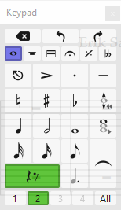|
    |Fig. 6 Voz 2| 

9.  Introduzca las primeras notas que pertenecen al acorde de Fa menor en la clave de sol.

    ||
    |:--:|
    |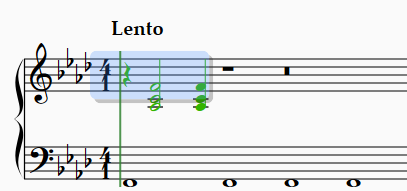|
    |Fig. 7 Seleccionar figuras| 

10. Seleccione las primeras tres figuras de la clave de sol y presione la tecla **r** (erre) que es para repetir.

11. Nuevamente repita con la tecla **(r)** (erre).

    ||
    |:--:|
    |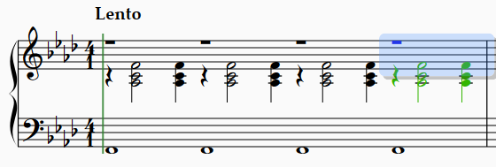|
    |Fig. 8 (r) Repetir| 

12. Abra el **Keytab** (Teclado flotante) y seleccione la voz 1.

    ||
    |:--:|
    |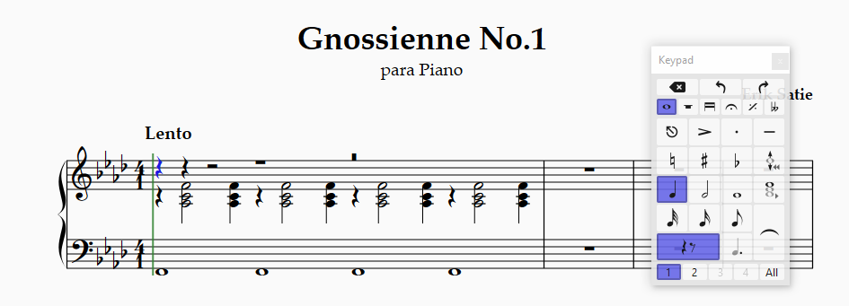|
    |Fig. 9 repetir nuevamente| 

13. Comience a introducir las notas de la melodía.

    ||
    |:--:|
    |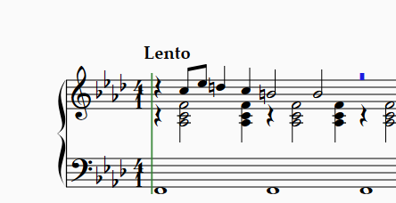|
    |Fig. 10 Introducir melodía| 

14. Para introducir el adorno de la *acciacatura*, realice los siguientes pasos:

    - Seleccione la corchea del teclado flotante en la primer pestaña.
  
    ||
    |:--:|
    |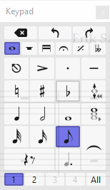|
    |Fig. 11 Seleccionar corchea| 

    - Abra la segunda pestaña del **Keytab** (Teclado flotante) y seleccione *acciacatura*.
    
    ||
    |:--:|
    |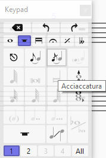|
    |Fig. 12 Acciacatura| 

15. Coloque el adorno delante de la nota correspondiente.

    ||
    |:--:|
    |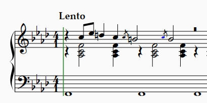|
    |Fig. 13 Colocar adorno| 

16. Seleccione las notas de la primera frase.

    ||
    |:--:|
    |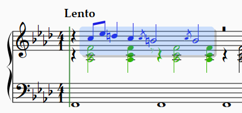|
    |Fig. 14 Seleccione frase 1| 

17. Presione la tecla **(l)** (ele) y seleccione **Slur** o ligadura.

    ||
    |:--:|
    ||
    |Fig. 15 Ligadura| 

  - Seguramente las notas de la voz 2 aparecerán con ligadura también. Por tanto seleccione la ligadura de la voz 2 y elimínela.

    ||
    |:--:|
    |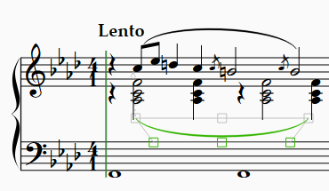|
    |Fig. 16 Eliminar ligadura de la voz 2| 

18. Seleccione nuevamente las notas de la frase 1.

    ||
    |:--:|
    |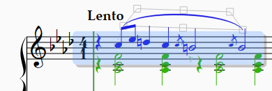|
    |Fig. 17 Seleccionar frase 1| 

19. Nuevamente oprima la tecla **(r)** (erre) para repetir.

    ||
    |:--:|
    |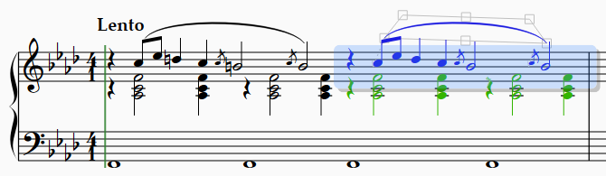|
    |Fig. 18 (r) Repetir| 

20. Continúe introduciendo las notas de la melodía con sus adornos y dinámicas.

    ||
    |:--:|
    |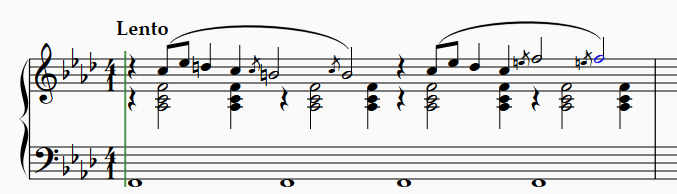|
    |Fig. 19 Continuar introduciendo notas| 

21. Seleccione la vista panorámica para revisar su progreso.
    ||
    |:--:|
    |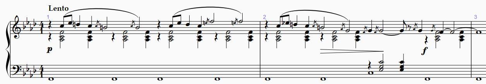|
    |Fig. 20 Vista panorámica| 

22. Finalizado el proceso de introducción de notas, seleccione el compás de 4/1, y elimínelo.

    ||
    |:--:|
    |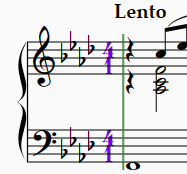|
    |Fig. 21 Seleccionar compás para eliminar| 

    - En la ventana emergente que pregunta si desea reescribir el mismo compás para los siguientes compases, elija **No**.
    
    ||
    |:--:|
    |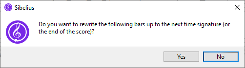|
    |Fig. 22 No reescribir compás| 

# :books: Referencias
- [Sibelius ® Guía de referencia](https://resources.avid.com/SupportFiles/Sibelius/8.4/L10N/ES/reference.pdf)

### Ir a la Página...
||
|:--|
|:arrow_backward: [Anterior](./01_acerca_del_proyecto.md)|

