<!-- Header -->
CEDART José Clemente Orozco - Mtro. Antonio Salazar Gómez | Copyright :copyright: Febrero de 2024

# :book: Transcribir una partitura para cuarteto de cuerdas

A continuación se describen los pasos para transcribir la partitura de piano en **SIbelius First**.

> Como requisito debe haber comprendido lo descrito en [Acerca del proyecto](./01_acerca_del_proyecto.md).

## Acerca de la división de las voces.

- El **Violonchelo** lleva la parte del bajo. Es preferible que en el caso particular de la pieza, ejecute los saltos extremos, usualmente de octava.

- La **Viola** canta la voz intermedia, reforzando y contraponiendo al bajo al mismo tiempo.

- Los **Violines 1 y 2** realizan la melodía, ejecutando las voces superiores, como si se tratase de Sopranos y Altos.

## Procedimiento

1. Abra la aplicación **Sibelius First**.

2. Seleccione la pestaña **New Score** (*Nueva Partitura*).

3. Navegue hasta encontrar la sección **Cuarteto de cuerdas**.

    ||
    |:--:|
    |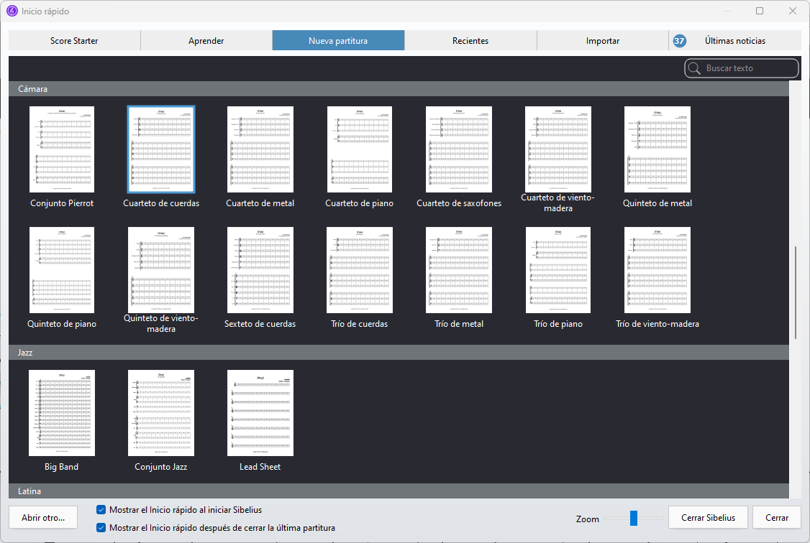|
    |Fig. 1 Cuarteto de cuerdas|

4. Se abrirá la pantalla de configuración de la partitura. Introduzca los siguientes datos:

   - **Configuración de indicación de compás**: **2/4** :point_left:
  
    ||
    |:--:|
    |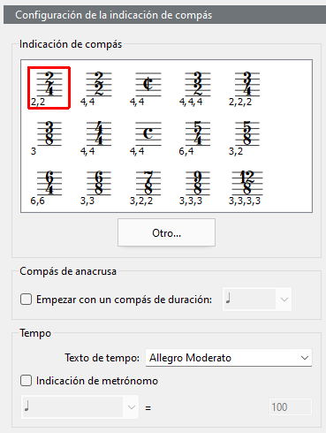|
    |Fig. 2 Compás| 

   - **Texto de tempo: Allegro Moderato**.

    ||
    |:--:|
    |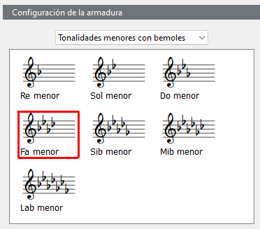|
    |Fig. 3 Tempo| 

   - Seleccione la tonalidad de Fa menor.
   - Introduzca Título, compositor y Copyright.
  
    ||
    |:--:|
    |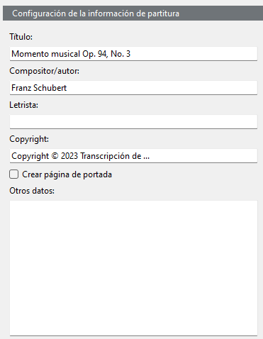|
    |Fig. 4 Tonalidad, título, compositor y copyright| 

5. Edite el encabezado.
 
    ||
    |:--:|
    |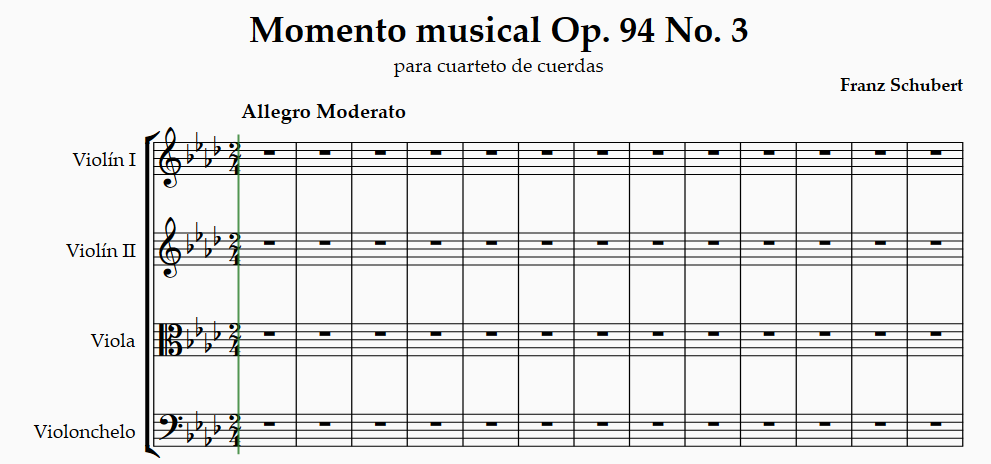|
    |Fig. 5 Editar encabezado| 

6. Seleccione el pentagrama de la clave de Fa, e introduzca las primeras  notas del Violonchelo, que es en este caso el bajo.

    ||
    |:--:|
    |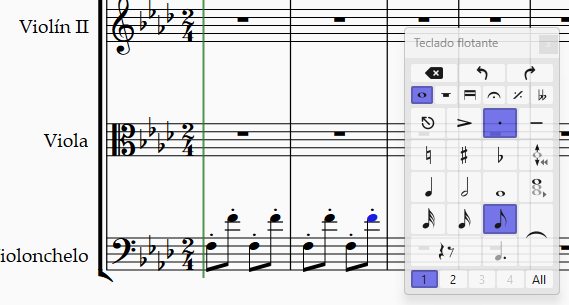|
    |Fig. 6 Bajo| 

7. Después posicione el cursor en la primera nota del pentagrama del Violonchelo.

8. Presione las teclas `CTRL + T`. Cuando el cursor parpadee, haga click derecho para abrir el menú de técnicas. Después seleccione **pizz.** (pizzicato)

    ||
    |:--:|
    |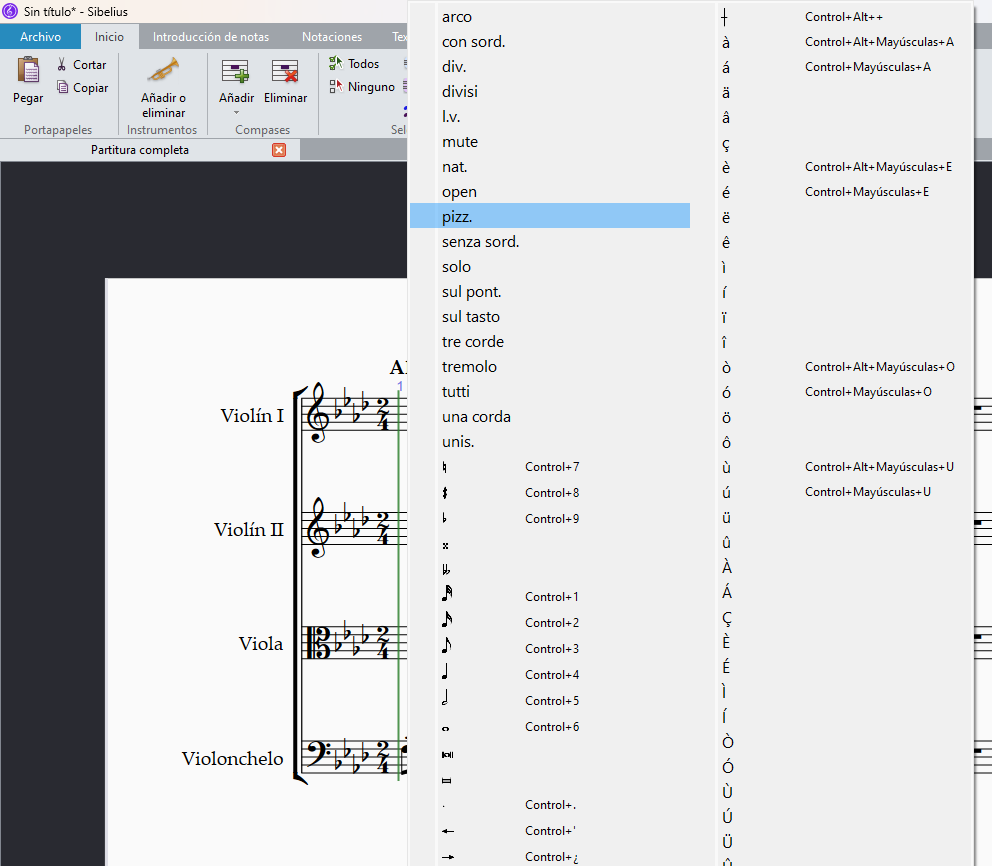|
    |Fig. 7 pizz.| 

9.  Introduzca las primeras notas de la **Viola**. Note que la viola comparte la voz grave del bajo, pero contrapone con la voz intermedia.

    ||
    |:--:|
    |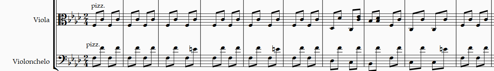|
    |Fig. 8 Viola| 

10. Ahora comience a introducir la voz del **Violín I**.

    ||
    |:--:|
    |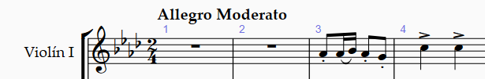|
    |Fig. 9 Violín I| 

11. Para introducir las notas de adorno realice los siguientes pasos:

- En el **Teclado flotante** sleccione la segunda pestaña y seleccione la **Appoggiatura**.
    
    ||
    |:--:|
    |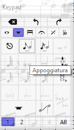|
    |Fig. 10 Appoggiatura| 

- En el **Teclado flotante** sleccione la primera pestaña y seleccione la **semicorchea**.

    ||
    |:--:|
    |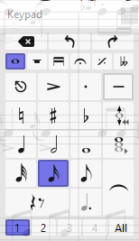|
    |Fig. 11 Semicorchea| 

- En el pentagrama del Violín I, coloque la nota de adorno delante de la nota afectada. (En este caso A)

    ||
    |:--:|
    |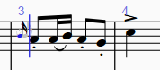|
    |Fig. 12 Colocar nota de adorno| 

12. Ahora coloque dos notas de adorno antes de la nota C5 del siguiente compás. Después de colocar la primer nota de adorno, presione la tecla (r) para repetir y escribir la segunda nota de adorno. Al final solamente ajuste la afinación de ésta.

    ||
    |:--:|
    |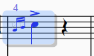|
    |Fig. 13 Seleccionar primera nota de adorno + (L)| 

13. Seleccione la primer nota de adorno del compás número 4. Después presione la tecla (L) para introducir ligadura. Elija ligadura superior.

    ||
    |:--:|
    |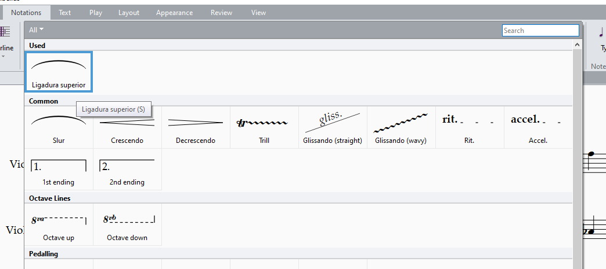|
    |Fig. 14 Menú de ligadura| 

14. Con la barra espaciadora avance la ligadura hasta conseguir que las notas estén ligadas.

    ||
    |:--:|
    |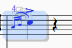|
    |Fig. 15 Ligadura escrita| 

15. Seleccione las tres primeras notas y presione (r) para repetir.

    ||
    |:--:|
    |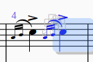|
    |Fig. 16 Repetir| 

16. Seleccione los compases 3 y 4 del **Violín I**.

    ||
    |:--:|
    |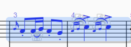|
    |Fig. 17 Selección para copia| 

17. Presione la combinación de teclas `CTRL + C`. Después coloque el cursor en el compás 3 del **Violín II** y presione `CTRL + V` para pegar.

18. Finalmente ajuste las notas del compás 4 para que el violín II quede una tercera debajo del violín I.

    ||
    |:--:|
    |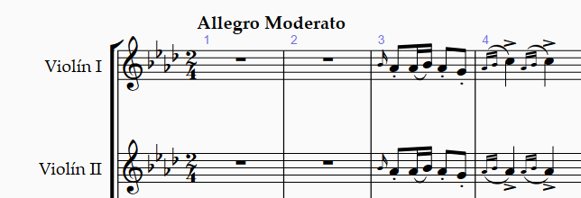|
    |Fig. 18 Violín II| 

19. Continúe introduccioneo las notas de los violines hasta completar la primera frase.

    ||
    |:--:|
    |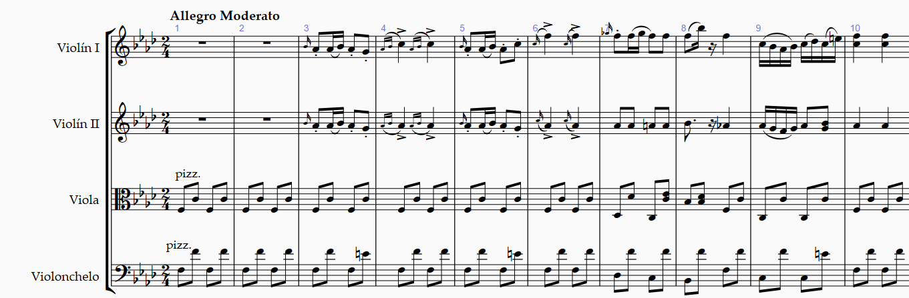|
    |Fig. 19 Primera frase del cuarteto| 

20. Añada símbolos de inicio de repetición en el compás 3, y fin de repetición en el compás 10.

- Seleccione la barra de compás 3.
- Abra el menú de notaciones y posteriormente seleccione las barras de compás. Después elija barra de inicio de repetición.
    
    ||
    |:--:|
    |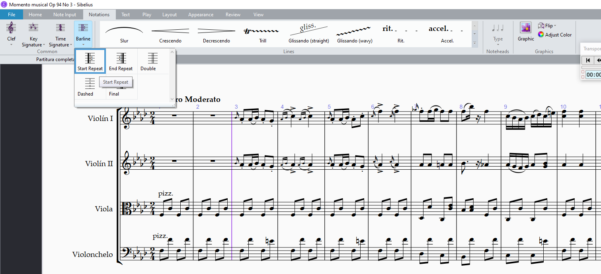|
    |Fig. 19.1 Símbolo de inicio repetición| 

- Seleccione la barra de compás 11.
- Abra el menú de notaciones y posteriormente seleccione las barras de compás. Después elija barra de fin de repetición.

    ||
    |:--:|
    |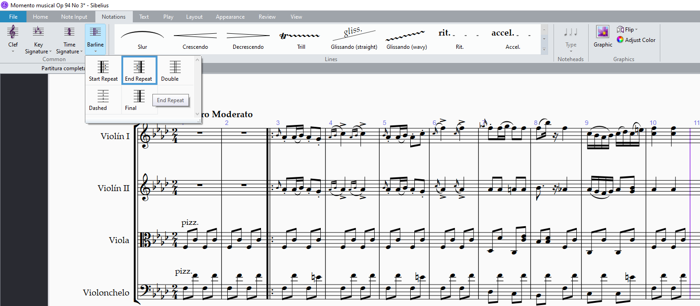|
    |Fig. 19.2 Símbolo de fin de repetición| 

- Debe quedar de la siguiente manera.

    ||
    |:--:|
    |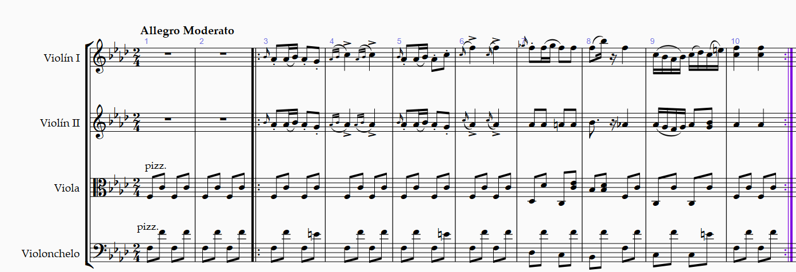|
    |Fig. 20 Símbolos de repetición| 

21. Continúe introduciendo la segunda frase de la pieza.

- Para cambiar la clave del Violonchelo seleccione el compás donde colocar la clave de sol.

- En la pestaña de notaciones, abra el menú de Claves, y seleccione la clave de sol.

    ||
    |:--:|
    |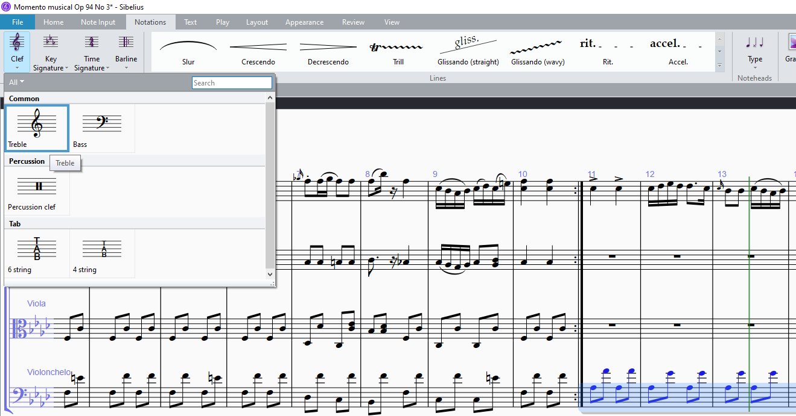|
    |Fig. 21.1 Clave de sol| 

- Continúe escribiendo la segunda frase.
 
    ||
    |:--:|
    |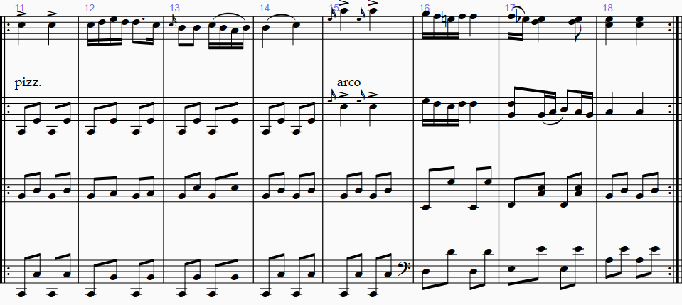|
    |Fig. 21.2 Segunda frase| 

22. Ahora introduzca la tercera frase.

    ||
    |:--:|
    |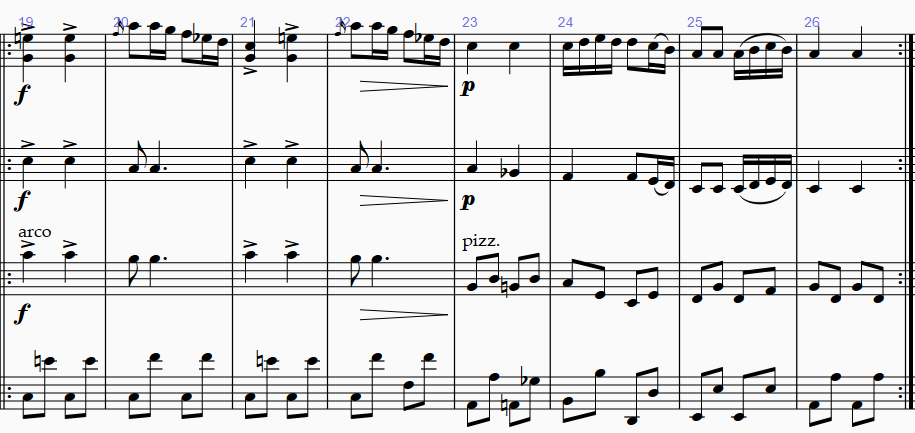|
    |Fig. 22 Tercera frase| 

23. Seleccione los compáses del 4 al 10, y después pegue en el compás 27.

    ||
    |:--:|
    |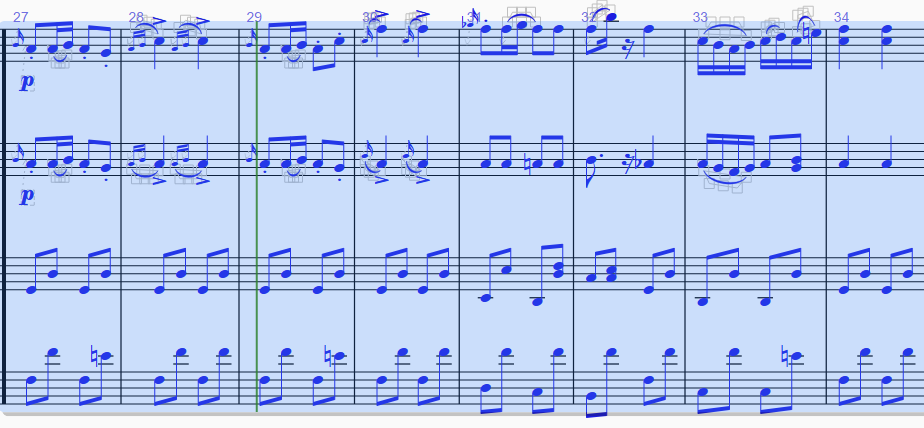|
    |Fig. 23 Pegar compases del 4 al 10 en el 27| 

24. Continúe introduciendo la siguiente frase.

    ||
    |:--:|
    |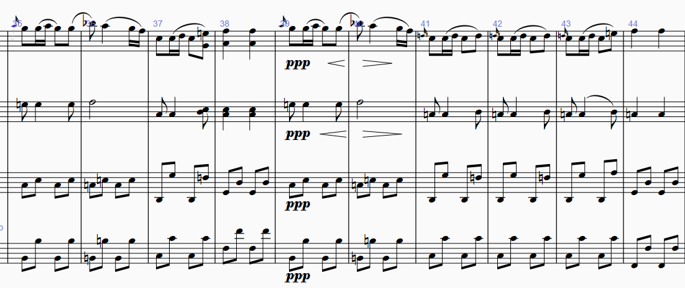|
    |Fig. 24 siguiente frase| 

25. Introduca la última frase.

    ||
    |:--:|
    |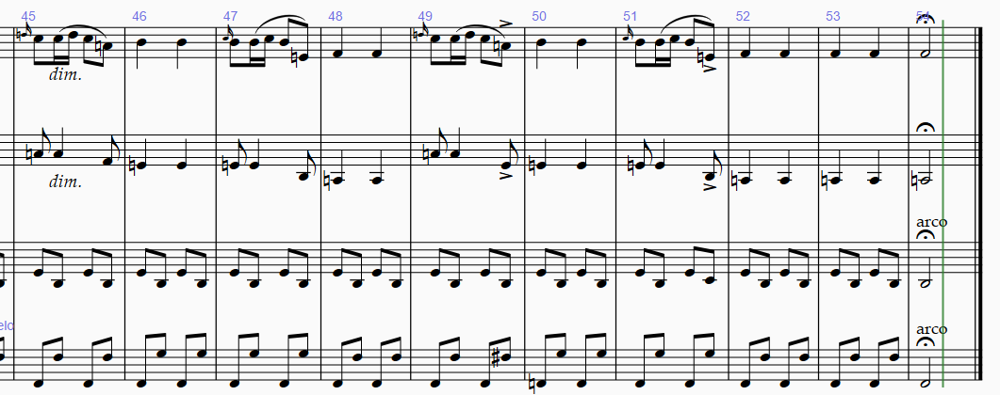|
    |Fig. 25 última frase| 

La partitura finalizada debe quedar de la siguiente manera: [Momento musical Op. 94 no.3 - para cuarteto de cuerdas](../../partituras/Momento%20musical%20Op.%2094%20No.%203%20-%20cuarteto%20de%20cuerdas.pdf)

# :books: Referencias
- [Franz Schubert](https://es.wikipedia.org/wiki/Franz_Schubert)
- [Seis momentos musicales D. 780](https://imslp.org/wiki/Moments_musicaux,_D.780_(Schubert,_Franz))
- [Sibelius ® Guía de referencia](https://resources.avid.com/SupportFiles/Sibelius/8.4/L10N/ES/reference.pdf)

### Ir a la Página...
||
|:--|
|:arrow_backward: [Anterior](./01_acerca_del_proyecto.md)|

