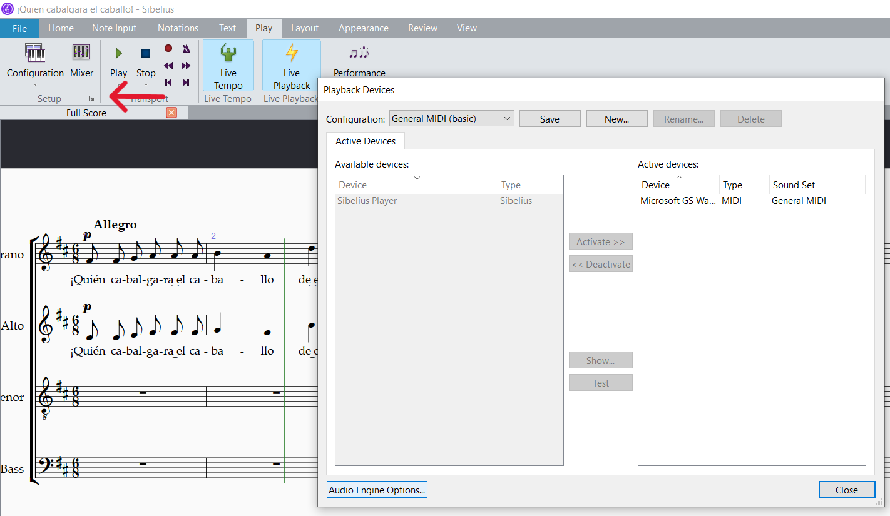
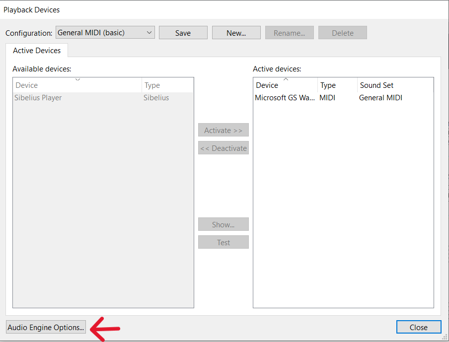

<!-- Header -->
CEDART José Clemente Orozco - Mtro. Antonio Salazar Gómez | Copyright :copyright: Febrero de 2024

# :mute: Sin sonido

## Síntoma

En algunas ocaciones el sonido no se reproduce en Sibelius 8.

## Causa

El controlador de audio no es soportado por el sistema operativo.

## Solución

Cambiar el controlador de audio:

1. Abra la pestaña de **Play** (Reproducción).

2. En la sección de **Setup** (Configuración) dé clic sobre el botón esquinado.

    ||
    |:--:|
    ||
    |Fig. 1 Setup (Configuración)|

3. En la ventana de Playback Devices (Dispositivos de reproducción) haga clic sobre el botón ***Audio Engine Options...*** (Opciones de Máquina de Audio...).

    ||
    |:--:|
    ||
    |Fig. 2 Audio Engine Options...|

4. Seleccione la interface correcta.

    ||
    |:--:|
    ||
    |Fig. 3 Selección de interface de audio|

5. Reinicie la aplicación de **Sibelius 8**.
  
# :books: References

- [Sibelius ® Guía de referencia](https://resources.avid.com/SupportFiles/Sibelius/8.4/L10N/ES/reference.pdf)

- [Sibelius ® Reference Guide](https://resources.avid.com/SupportFiles/Sibelius/8.2/reference.pdf)
