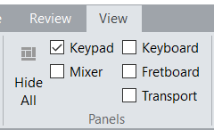
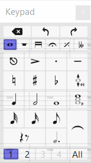
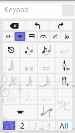
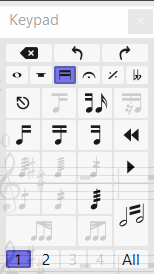

<!-- Header -->
CEDART José Clemente Orozco - Mtro. Antonio Salazar Gómez | Copyright :copyright: Febrero de 2024

# :musical_score: Mostrar el teclado flotante

Para mostrar el teclado flotante realice los siguientes pasos:

1. Seleccionar la pestaña **View** (Vista).
2. Elegir la opción **Keypad** (Teclado flotante).

    ||
    |:--:|
    ||
    |Fig. 1 View - Keypad|

3. El **Keypad** (teclado flotante) debe mostrarse en pantalla.

    ||
    |:--:|
    ||
    |Fig. 2 Keypad|

4. Otra manera de mostrar u ocultar el **Keypad** (teclado flotante) es utilizando la combinación `CTRL + ALT + K`.

## Páginas del teclado flotante

||||
|:--:|:--:|:--:|
||||
|Common Notes (F7)|More Notes (F8)|Beams/Tremolos (F9)|
|Notas comunes (F7)|Más notas (F8)|Barras/Trémolos (F9)|
||||
|Articulation (F10)|Jazz articulations (F11)|Accidentals (F12)|
|Articulación (F10)|Articulaciones de jazz (F11)|Alteraciones (F12)|

# :books: References

- [Sibelius ® Guía de referencia - 3.2 Teclado Flotante](https://resources.avid.com/SupportFiles/Sibelius/8.4/L10N/ES/reference.pdf)

- [Sibelius ® Reference Guide - 3.2 Keypad](https://resources.avid.com/SupportFiles/Sibelius/8.2/reference.pdf)